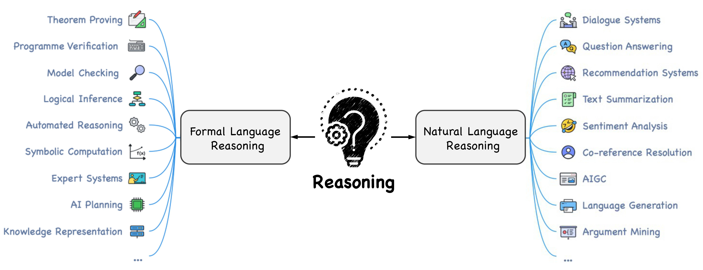
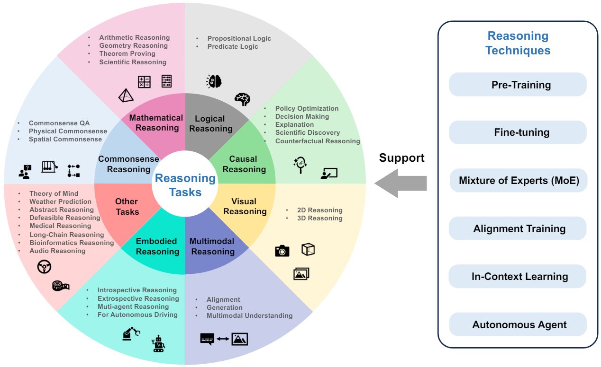
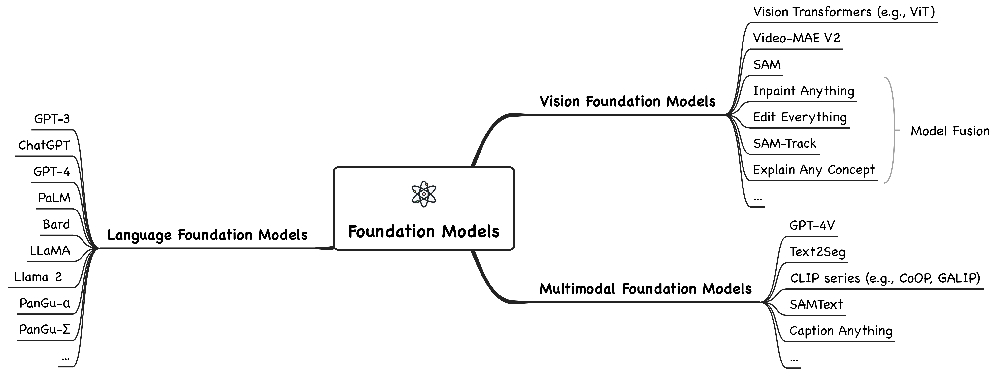

# Awesome-Reasoning-Foundation-Models
[](https://awesome.re)
[](https://doi.org/10.5281/zenodo.10298864)
[](https://arxiv.org/abs/2312.11562)


 

[`survey.pdf`](https://arxiv.org/pdf/2312.11562.pdf) |
A curated list of awesome **large AI models**, or **foundation models**, for **reasoning**.

We organize the current [foundation models](#2-foundation-models) into three categories: *language foundation models*, *vision foundation models*, and *multimodal foundation models*.
Further, we elaborate the foundation models in [reasoning tasks](#3-reasoning-tasks), including *commonsense*, *mathematical*, *logical*, *causal*, *visual*, *audio*, *multimodal*, *agent reasoning*, etc.
[Reasoning techniques](#4-reasoning-techniques), including *pre-training*, *fine-tuning*, *alignment training*, *mixture of experts*, *in-context learning*, and *autonomous agent*, are also summarized.

We welcome contributions to this repository to add more resources. Please submit a pull request if you want to contribute! See [CONTRIBUTING](CONTRIBUTING.md).

<!-- ## News -->


## Table of Contents

<details open>
<summary>table of contents</summary>

- [0 Survey](#0-survey)
- [1 Relevant Surveys](#1-relevant-surveys-and-links)
- [2 Foundation Models](#2-foundation-models)
  - [2.1 Language Foundation Models](#21-language-foundation-models)
  - [2.2 Vision Foundation Models](#22-vision-foundation-models)
  - [2.3 Multimodal Foundation Models](#23-multimodal-foundation-models)
  - [2.4 Reasoning Applications](#24-reasoning-applications)
- [3 Reasoning Tasks](#3-reasoning-tasks)
  - [3.1 Commonsense Reasoning](#31-commonsense-reasoning)
  - [3.2 Mathematical Reasoning](#32-mathematical-reasoning)
  - [3.3 Logical Reasoning](#33-logical-reasoning)
  - [3.4 Causal Reasoning](#34-causal-reasoning)
  - [3.5 Visual Reasoning](#35-visual-reasoning)
  - [3.6 Audio Reasoning](#36-audio-reasoning)
  - [3.7 Multimodal Reasoning](#37-multimodal-reasoning)
  - [3.8 Agent Reasoning](#38-agent-reasoning)
  - [3.9 Other Tasks and Applications](#39-other-tasks-and-applications)
- [4 Reasoning Techniques](#4-reasoning-techniques)
  - [4.1 Pre-Training](#41-pre-training)
  - [4.2 Fine-Tuning](#42-fine-tuning)
  - [4.3 Alignment Training](#43-alignment-training)
  - [4.4 Mixture of Experts (MoE)](#44-mixture-of-experts-moe)
  - [4.5 In-Context Learning](#45-in-context-learning)
  - [4.6 Autonomous Agent](#46-autonomous-agent)

</details>


## 0 Survey



This repository is primarily based on the following paper:

>[**A Survey of Reasoning with Foundation Models**](https://arxiv.org/abs/2312.11562) <br>
>
> [Jiankai Sun](),
[Chuanyang Zheng](https://chuanyang-zheng.github.io/),
[Enze Xie](https://xieenze.github.io/),
[Zhengying Liu](https://scholar.google.com/citations?user=DFme0joAAAAJ&hl=fr),
[Ruihang Chu](),
[Jianing Qiu](),
[Jiaqi Xu](),
[Mingyu Ding](),
[Hongyang Li](https://lihongyang.info/),
[Mengzhe Geng](),
[Yue Wu](),
[Wenhai Wang](https://whai362.github.io/),
[Junsong Chen](),
[Zhangyue Yin](),
[Xiaozhe Ren](),
[Jie Fu](https://bigaidream.github.io/),
[Junxian He](https://jxhe.github.io/),
[Wu Yuan](http://www.bme.cuhk.edu.hk/yuan/),
[Qi Liu](https://leuchine.github.io/),
[Xihui Liu](https://xh-liu.github.io/),
[Yu Li](https://liyu95.com/),
[Hao Dong](https://zsdonghao.github.io/),
[Yu Cheng](https://scholar.google.com/citations?user=ORPxbV4AAAAJ&hl=zh-CN),
[Ming Zhang](https://scholar.google.com/citations?user=LbzoQBsAAAAJ&hl=en),
[Pheng Ann Heng](http://www.cse.cuhk.edu.hk/~pheng/),
[Jifeng Dai](https://jifengdai.org/),
[Ping Luo](http://luoping.me/),
[Jingdong Wang](https://jingdongwang2017.github.io/),
[Ji-Rong Wen](https://scholar.google.com/citations?user=tbxCHJgAAAAJ&hl=zh-CN),
[Xipeng Qiu](https://xpqiu.github.io/),
[Yike Guo](https://cse.hkust.edu.hk/admin/people/faculty/profile/yikeguo),
[Hui Xiong](https://scholar.google.com/citations?user=cVDF1tkAAAAJ&hl=en),
[Qun Liu](https://liuquncn.github.io/index_zh.html), and
[Zhenguo Li](https://scholar.google.com/citations?user=XboZC1AAAAAJ&hl=en)

If you find this repository helpful, please consider citing:

```bibtex
@article{sun2023survey,
  title={A Survey of Reasoning with Foundation Models},
  author={Sun, Jiankai and Zheng, Chuanyang and Xie, Enze and Liu, Zhengying and Chu, Ruihang and Qiu, Jianing and Xu, Jiaqi and Ding, Mingyu and Li, Hongyang and Geng, Mengzhe and others},
  journal={arXiv preprint arXiv:2312.11562},
  year={2023}
}
```


## 1 Relevant Surveys and Links

<details open>
<summary>relevant surveys</summary>

[(Back-to-Top)](#table-of-contents)

- Combating Misinformation in the Age of LLMs: Opportunities and Challenges
\-
[[arXiv](https://arxiv.org/abs/2311.05656)]
[[Link](https://llm-misinformation.github.io/)]

- The Rise and Potential of Large Language Model Based Agents: A Survey
\-
[[arXiv](https://arxiv.org/abs/2309.07864)]
[[Link](https://github.com/WooooDyy/LLM-Agent-Paper-List)]

- Multimodal Foundation Models: From Specialists to General-Purpose Assistants
\-
[[arXiv](https://arxiv.org/abs/2309.10020)]
[[Tutorial](https://vlp-tutorial.github.io/2023/)]

- A Survey on Multimodal Large Language Models
\-
[[arXiv](https://arxiv.org/abs/2306.13549)]
[[Link](https://github.com/BradyFU/Awesome-Multimodal-Large-Language-Models)]

- Interactive Natural Language Processing
\-
[[arXiv](https://arxiv.org/abs/2305.13246)]
[[Link](https://github.com/InteractiveNLP-Team/awesome-InteractiveNLP-papers)]

- A Survey of Large Language Models
\-
[[arXiv](https://arxiv.org/abs/2303.18223)]
[[Link](https://github.com/RUCAIBox/LLMSurvey)]

- Self-Supervised Multimodal Learning: A Survey
\-
[[arXiv](https://arxiv.org/abs/2304.01008)]
[[Link](https://github.com/ys-zong/awesome-self-supervised-multimodal-learning)]

- Large AI Models in Health Informatics: Applications, Challenges, and the Future
\-
[[arXiv](https://arxiv.org/abs/2303.11568)]
[[Paper](https://ieeexplore.ieee.org/document/10261199)]
[[Link](https://github.com/Jianing-Qiu/Awesome-Healthcare-Foundation-Models)]

- Towards Reasoning in Large Language Models: A Survey
\-
[[arXiv](https://arxiv.org/abs/2212.10403)]
[[Paper](https://aclanthology.org/2023.findings-acl.67.pdf)]
[[Link](https://github.com/jeffhj/LM-reasoning)]

- Reasoning with Language Model Prompting: A Survey
\-
[[arXiv](https://arxiv.org/abs/2212.09597)]
[[Paper](https://aclanthology.org/2023.acl-long.294.pdf)]
[[Link](https://github.com/zjunlp/Prompt4ReasoningPapers)]

- Awesome Multimodal Reasoning
\-
[[Link](https://github.com/atfortes/Awesome-Multimodal-Reasoning)]

</details>


## 2 Foundation Models

<details open>
<summary>foundation models</summary>

[(Back-to-Top)](#table-of-contents)



### Table of Contents - 2

<details open>
<summary>foundation models (table of contents)</summary>

[(Back-to-Top)](#table-of-contents)

- [2 Foundation Models](#2-foundation-models)
  - [2.1 Language Foundation Models](#21-language-foundation-models)
  - [2.2 Vision Foundation Models](#22-vision-foundation-models)
  - [2.3 Multimodal Foundation Models](#23-multimodal-foundation-models)
  - [2.4 Reasoning Applications](#24-reasoning-applications)

</details>

### 2.1 Language Foundation Models

<details open>
<summary>LFMs</summary>

[Foundation Models (Back-to-Top)](#2-foundation-models)

- `2023/10` | `Mistral` | [Mistral 7B](https://arxiv.org/abs/2310.06825)
\-
[[Paper](https://arxiv.org/pdf/2310.06825.pdf)]
[[Code](https://github.com/mistralai/mistral-src?tab=readme-ov-file)]

- `2023/09` | `Qwen` | [Qwen Technical Report](https://arxiv.org/abs/2309.16609)
\-
[[Paper](https://arxiv.org/pdf/2309.16609.pdf)]
[[Code](https://github.com/QwenLM/Qwen)]
[[Project](https://tongyi.aliyun.com/qianwen/)]

- `2023/07` | `Llama 2` | [Llama 2: Open Foundation and Fine-Tuned Chat Models](https://arxiv.org/abs/2307.09288)
\-
[[Paper](https://arxiv.org/pdf/2307.09288.pdf)]
[[Code](https://github.com/facebookresearch/llama)]
[[Blog](https://ai.meta.com/llama/)]

- `2023/07` | `InternLM` | InternLM: A Multilingual Language Model with Progressively Enhanced Capabilities
\-
[[Paper](https://github.com/InternLM/InternLM-techreport/blob/main/InternLM.pdf)]
[[Code](https://github.com/InternLM/InternLM)]
[[Project](https://internlm.intern-ai.org.cn)]

- `2023/05` | `PaLM 2` | [PaLM 2 Technical Report](https://arxiv.org/abs/2305.10403)
\-

- `2023/03` | `PanGu-Σ` | [PanGu-Σ: Towards Trillion Parameter Language Model with Sparse Heterogeneous Computing](https://arxiv.org/pdf/2303.10845.pdf)
\-
[[Paper](https://arxiv.org/abs/2303.10845)]

- `2023/03` | `Vicuna` | Vicuna: An Open-Source Chatbot Impressing GPT-4 with 90%* ChatGPT Quality
\-
[[Blog](https://lmsys.org/blog/2023-03-30-vicuna/)]
[[Code](https://github.com/lm-sys/FastChat)]

- `2023/03` | `GPT-4` | [GPT-4 Technical Report](https://arxiv.org/abs/2303.08774)
\-
[[Paper](https://arxiv.org/pdf/2303.08774.pdf)]
[[Blog](https://openai.com/research/gpt-4)]

- `2023/02` | `LLaMA` | [LLaMA: Open and Efficient Foundation Language Models](https://arxiv.org/abs/2302.13971)
\-
[[Paper](https://arxiv.org/pdf/2302.13971.pdf)]
[[Code](https://github.com/facebookresearch/llama)]
[[Blog](https://ai.meta.com/blog/large-language-model-llama-meta-ai/)]

- `2022/11` | `ChatGPT` | Chatgpt: Optimizing language models for dialogue
\-
[[Blog](https://openai.com/blog/chatgpt)]

- `2022/04` | `PaLM` | [PaLM: Scaling Language Modeling with Pathways](https://arxiv.org/abs/2204.02311)
\-
[[Paper](https://arxiv.org/pdf/2204.02311.pdf)]
[[Blog](https://blog.research.google/2022/04/pathways-language-model-palm-scaling-to.html)]

- `2021/09` | `FLAN` | [Finetuned Language Models Are Zero-Shot Learners](https://arxiv.org/abs/2109.01652)
\-

- `2021/07` | `Codex` | [Evaluating Large Language Models Trained on Code](https://arxiv.org/abs/2107.03374)
\-

- `2021/05` | `GPT-3` | [Language Models are Few-Shot Learners](https://arxiv.org/abs/2005.14165)
\-
[[Paper](https://papers.nips.cc/paper/2020/file/1457c0d6bfcb4967418bfb8ac142f64a-Paper.pdf)]
[[Code](https://github.com/openai/gpt-3)]

- `2021/04` | `PanGu-α` | [PanGu-α: Large-scale Autoregressive Pretrained Chinese Language Models with Auto-parallel Computation](https://arxiv.org/abs/2104.12369)
\-
[[Paper](https://arxiv.org/pdf/2104.12369.pdf)]
[[Code](https://github.com/huawei-noah/Pretrained-Language-Model)]

- `2019/08` | `Sentence-BERT` | [Sentence-BERT: Sentence Embeddings using Siamese BERT-Networks
](https://arxiv.org/abs/1908.10084)
\-

- `2019/07` | `RoBERTa` | [RoBERTa: A Robustly Optimized BERT Pretraining Approach](https://arxiv.org/abs/1907.11692)
\-

- `2018/10` | `BERT` | [BERT: Pre-training of Deep Bidirectional Transformers for Language Understanding](https://arxiv.org/abs/1810.04805)
\-
[[Paper](https://aclanthology.org/N19-1423.pdf)]
[[Code](https://github.com/google-research/bert)]
[[Blog](https://blog.research.google/2018/11/open-sourcing-bert-state-of-art-pre.html)]

---

</details>

<!--  -->
### 2.2 Vision Foundation Models

<details open>
<summary>VFMs</summary>

[Foundation Models (Back-to-Top)](#2-foundation-models)

- `2024/01` | `Depth Anything`
| `Yang et al.`

 <br>
Depth Anything: Unleashing the Power of Large-Scale Unlabeled Data <br>
[[arXiv](https://arxiv.org/abs/2401.10891)]
[[paper](https://arxiv.org/pdf/2401.10891.pdf)]
[[code](https://github.com/LiheYoung/Depth-Anything)]
[[project](https://depth-anything.github.io/)]

- `2023/05` | `SAA+`
| `Cao et al.`

 <br>
Segment Any Anomaly without Training via Hybrid Prompt Regularization <br>
[[arXiv](https://arxiv.org/abs/2305.10724)]
[[paper](https://arxiv.org/pdf/2305.10724.pdf)]
[[code](https://github.com/caoyunkang/Segment-Any-Anomaly)]

- `2023/05` | `Explain Any Concept` | [Explain Any Concept: Segment Anything Meets Concept-Based Explanation](https://arxiv.org/abs/2305.10289)
\-
[[Paper](https://arxiv.org/pdf/2305.10289.pdf)]
[[Code](https://github.com/Jerry00917/samshap)]

- `2023/05` | `SAM-Track` | [Segment and Track Anything](https://arxiv.org/abs/2305.06558)
\-
[[Paper](https://arxiv.org/pdf/2305.06558.pdf)]
[[Code](https://github.com/z-x-yang/Segment-and-Track-Anything)]

- `2023/05` | `SAMRS` | [SAMRS: Scaling-up Remote Sensing Segmentation Dataset with Segment Anything Model](https://arxiv.org/abs/2305.02034)
\-
[[Paper](https://arxiv.org/pdf/2305.02034.pdf)]
[[Code](https://github.com/ViTAE-Transformer/SAMRS)]

- `2023/04` | `Edit Everything` | [Edit Everything: A Text-Guided Generative System for Images Editing](https://arxiv.org/abs/2304.14006)
\-
[[Paper](https://arxiv.org/pdf/2304.14006.pdf)]
[[Code](https://github.com/DefengXie/Edit_Everything)]

- `2023/04` | `Inpaint Anything` | [Inpaint Anything: Segment Anything Meets Image Inpainting](https://arxiv.org/abs/2304.06790)
\-
[[Paper](https://arxiv.org/pdf/2304.06790.pdf)]
[[Code](https://github.com/geekyutao/Inpaint-Anything)]

- `2023/04` | `SAM`
| `Kirillov et al., ICCV 2023`

 <br>
Segment Anything <br>
[[arXiv](https://arxiv.org/abs/2304.02643)]
[[paper](https://openaccess.thecvf.com/content/ICCV2023/html/Kirillov_Segment_Anything_ICCV_2023_paper.html)]
[[code](https://github.com/facebookresearch/segment-anything)]
[[blog](https://segment-anything.com/)]

- `2023/03` | `VideoMAE V2` | [VideoMAE V2: Scaling Video Masked Autoencoders with Dual Masking](https://arxiv.org/abs/2303.16727)
\-
[[Paper](https://openaccess.thecvf.com/content/CVPR2023/papers/Wang_VideoMAE_V2_Scaling_Video_Masked_Autoencoders_With_Dual_Masking_CVPR_2023_paper.pdf)]
[[Code](https://github.com/OpenGVLab/VideoMAEv2)]

- `2023/03` | `Grounding DINO`
| `Liu et al.`

 <br>
Grounding DINO: Marrying DINO with Grounded Pre-Training for Open-Set Object Detection <br>
[[arXiv](https://arxiv.org/abs/2303.05499)]
[[paper](https://arxiv.org/pdf/2303.05499.pdf)]
[[code](https://github.com/IDEA-Research/GroundingDINO)]

- `2022/03` | `VideoMAE` | [VideoMAE: Masked Autoencoders are Data-Efficient Learners for Self-Supervised Video Pre-Training](https://arxiv.org/abs/2203.12602)
\-
[[Paper](https://proceedings.neurips.cc/paper_files/paper/2022/hash/416f9cb3276121c42eebb86352a4354a-Abstract-Conference.html)]
[[Code](https://github.com/MCG-NJU/VideoMAE)]

- `2021/12` | `Stable Diffusion`
| `Rombach et al., CVPR 2022`

 <br>
High-Resolution Image Synthesis with Latent Diffusion Models <br>
[[arXiv](https://arxiv.org/abs/2112.10752)]
[[paper](https://openaccess.thecvf.com/content/CVPR2022/html/Rombach_High-Resolution_Image_Synthesis_With_Latent_Diffusion_Models_CVPR_2022_paper.html)]
[[code](https://github.com/CompVis/latent-diffusion)]
[[stable diffusion](https://github.com/Stability-AI/stablediffusion)
]

- `2021/09` | `LaMa` | [Resolution-robust Large Mask Inpainting with Fourier Convolutions](https://arxiv.org/abs/2109.07161)
\-
[[Paper](https://openaccess.thecvf.com/content/WACV2022/papers/Suvorov_Resolution-Robust_Large_Mask_Inpainting_With_Fourier_Convolutions_WACV_2022_paper.pdf)]
[[Code](https://github.com/advimman/lama)]

- `2021/03` | `Swin`
| `Liu et al., ICCV 2021`

 <br>
Swin Transformer: Hierarchical Vision Transformer using Shifted Windows <br>
[[arXiv](https://arxiv.org/abs/2103.14030)]
[[paper](https://openaccess.thecvf.com/content/ICCV2021/html/Liu_Swin_Transformer_Hierarchical_Vision_Transformer_Using_Shifted_Windows_ICCV_2021_paper.html)]
[[code](https://github.com/microsoft/Swin-Transformer)]

- `2020/10` | `ViT`
| `Dosovitskiy et al., ICLR 2021`
 <br>
An Image is Worth 16x16 Words: Transformers for Image Recognition at Scale <br>
[[arXiv](https://arxiv.org/abs/2010.11929)]
[[paper](https://openreview.net/forum?id=YicbFdNTTy)]
[[Implementation](https://github.com/lucidrains/vit-pytorch)]

---

</details>

<!--  -->
### 2.3 Multimodal Foundation Models

<details open>
<summary>MFMs</summary>

[Foundation Models (Back-to-Top)](#2-foundation-models)

- `2024/01` | `LLaVA-1.6`
| `Liu et al.` <br>
LLaVA-1.6: Improved reasoning, OCR, and world knowledge <br>
[[code](https://github.com/haotian-liu/LLaVA)]
[[blog](https://llava-vl.github.io/blog/2024-01-30-llava-1-6/)]

- `2024/01` | `MouSi`
| `Fan et al.`
 <br>
MouSi: Poly-Visual-Expert Vision-Language Models <br>
[[arXiv](https://arxiv.org/abs/2401.17221)]
[[paper](https://arxiv.org/pdf/2401.17221.pdf)]
[[code](https://github.com/FudanNLPLAB/MouSi)]

- `2023/12` | `InternVL`
| `Chen et al.`

 <br>
InternVL: Scaling up Vision Foundation Models and Aligning for Generic Visual-Linguistic Tasks <br>
[[arXiv](https://arxiv.org/abs/2312.14238)]
[[paper](https://arxiv.org/pdf/2312.14238.pdf)]
[[code](https://github.com/OpenGVLab/InternVL)]

- `2023/12` | `Gemini` | [Gemini: A Family of Highly Capable Multimodal Models](https://arxiv.org/abs/2312.11805)
\-
[[Paper](https://arxiv.org/pdf/2312.11805.pdf)]
[[Project](https://deepmind.google/technologies/gemini/#introduction)]

- `2023/10` | `LLaVA-1.5`
| `Liu et al.`
 <br>
Improved Baselines with Visual Instruction Tuning <br>[[arXiv](https://arxiv.org/abs/2310.03744)]
[[paper](https://arxiv.org/pdf/2310.03744.pdf)]
[[code](https://github.com/haotian-liu/LLaVA)]
[[project](https://llava-vl.github.io)]

- `2023/09` | `GPT-4V` | GPT-4V(ision) System Card
\-
[[Paper](https://cdn.openai.com/papers/GPTV_System_Card.pdf)]
[[Blog](https://openai.com/research/gpt-4v-system-card)]

- `2023/08` | `Qwen-VL` | [Qwen-VL: A Versatile Vision-Language Model for Understanding, Localization, Text Reading, and Beyond](https://arxiv.org/abs/2308.12966)
\-
[[Paper](https://arxiv.org/pdf/2308.12966.pdf)]
[[Code](https://github.com/QwenLM/Qwen-VL)]

- `2023/05` | `InstructBLIP` | [InstructBLIP: Towards General-purpose Vision-Language Models with Instruction Tuning](https://arxiv.org/abs/2305.06500)
\-
[[Paper](https://openreview.net/pdf?id=vvoWPYqZJA)]
[[Code](https://github.com/salesforce/LAVIS/tree/main/projects/instructblip)]

- `2023/05` | `Caption Anything` | [Caption Anything: Interactive Image Description with Diverse Multimodal Controls](https://arxiv.org/abs/2305.02677)
\-
[[Paper](https://arxiv.org/pdf/2305.02677.pdf)]
[[Code](https://github.com/ttengwang/Caption-Anything)]

- `2023/05` | `SAMText` | [Scalable Mask Annotation for Video Text Spotting](https://arxiv.org/abs/2305.01443)
\-
[[Paper](https://arxiv.org/pdf/2305.01443.pdf)]
[[Code](https://github.com/ViTAE-Transformer/SAMText)]

- `2023/04` | `Text2Seg` | [Text2Seg: Remote Sensing Image Semantic Segmentation via Text-Guided Visual Foundation Models](https://arxiv.org/abs/2304.10597)
\-
[[Paper](https://arxiv.org/pdf/2304.10597.pdf)]

- `2023/04` | `MiniGPT-4` | [MiniGPT-4: Enhancing Vision-Language Understanding with Advanced Large Language Models](https://arxiv.org/abs/2304.10592)
\-

- `2023/04` | `LLaVA` | [Visual Instruction Tuning](https://arxiv.org/abs/2304.08485)
\-
[[Paper](https://openreview.net/pdf?id=w0H2xGHlkw)]
[[Code](https://github.com/haotian-liu/LLaVA)]
[[Project](https://llava-vl.github.io)]

- `2023/04` | `CLIP Surgery` | [CLIP Surgery for Better Explainability with Enhancement in Open-Vocabulary Tasks](https://arxiv.org/abs/2304.05653)
\-
[[Paper](https://arxiv.org/pdf/2304.05653.pdf)]
[[Code](https://github.com/xmed-lab/CLIP_Surgery)]

- `2023/03` | `UniDiffuser` | [One Transformer Fits All Distributions in Multi-Modal Diffusion at Scale](https://arxiv.org/abs/2303.06555)
\-

- `2023/01` | `GALIP` | [GALIP: Generative Adversarial CLIPs for Text-to-Image Synthesis](https://arxiv.org/abs/2301.12959)
\-
[[Paper](https://openaccess.thecvf.com/content/CVPR2023/papers/Tao_GALIP_Generative_Adversarial_CLIPs_for_Text-to-Image_Synthesis_CVPR_2023_paper.pdf)]
[[Code](https://github.com/tobran/GALIP)]

- `2023/01` | `BLIP-2` | [BLIP-2: Bootstrapping Language-Image Pre-training with Frozen Image Encoders and Large Language Models](https://arxiv.org/abs/2301.12597)
\-
[[Paper](https://proceedings.mlr.press/v202/li23q.html)]
[[Code](https://github.com/salesforce/LAVIS/tree/main/projects/blip2)]

- `2022/12` | `Img2Prompt` | [From Images to Textual Prompts: Zero-shot VQA with Frozen Large Language Models](https://arxiv.org/abs/2212.10846)
\-

- `2022/05` | `CoCa` | [CoCa: Contrastive Captioners are Image-Text Foundation Models](https://arxiv.org/abs/2205.01917)
\-
[[Paper](https://openreview.net/forum?id=Ee277P3AYC)]

- `2022/01` | `BLIP` | [BLIP: Bootstrapping Language-Image Pre-training for Unified Vision-Language Understanding and Generation](https://arxiv.org/abs/2201.12086)
\-
[[Paper](https://proceedings.mlr.press/v162/li22n.html)]
[[Code](https://github.com/salesforce/BLIP)]

- `2021/09` | `CoOp` | [Learning to Prompt for Vision-Language Models](https://arxiv.org/abs/2109.01134)
\-
[[Paper](https://link.springer.com/article/10.1007/s11263-022-01653-1)]
[[Code](https://github.com/KaiyangZhou/CoOp)]

- `2021/02` | `CLIP` | [Learning Transferable Visual Models From Natural Language Supervision](https://arxiv.org/abs/2103.00020)
\-
[[Paper](https://proceedings.mlr.press/v139/radford21a/radford21a.pdf)]
[[Code](https://github.com/openai/CLIP)]
[[Blog](https://openai.com/research/clip)]

---

</details>

<!--  -->
### 2.4 Reasoning Applications

<details open>
<summary>reasoning applications</summary>

[Foundation Models (Back-to-Top)](#2-foundation-models)

- `2022/06` | `Minerva` | [Solving Quantitative Reasoning Problems with Language Models](https://arxiv.org/abs/2206.14858)
\-
[[Paper](https://openreview.net/pdf?id=IFXTZERXdM7)]
[[Blog](https://blog.research.google/2022/06/minerva-solving-quantitative-reasoning.html)]

- `2022/06` | `BIG-bench` | [Beyond the Imitation Game: Quantifying and extrapolating the capabilities of language models](https://arxiv.org/abs/2206.04615)
\-
[[Paper](https://openreview.net/pdf?id=uyTL5Bvosj)]
[[Code](https://github.com/google/BIG-bench)]

- `2022/05` | `Zero-shot-CoT` | [Large Language Models are Zero-Shot Reasoners](https://arxiv.org/abs/2205.11916)
\-
[[Paper](https://openreview.net/pdf?id=e2TBb5y0yFf)]
[[Code](https://github.com/kojima-takeshi188/zero_shot_cot)]

- `2022/03` | `STaR` | [STaR: Bootstrapping Reasoning With Reasoning](https://arxiv.org/abs/2203.14465)
\-
[[Paper](https://openreview.net/pdf?id=_3ELRdg2sgI)]
[[Code](https://github.com/ezelikman/STaR)]

- `2021/07` |  `MWP-BERT` | [MWP-BERT: Numeracy-Augmented Pre-training for Math Word Problem Solving](https://arxiv.org/abs/2107.13435)
\-
[[Paper](https://aclanthology.org/2022.findings-naacl.74.pdf)]
[[Code](https://github.com/LZhenwen/MWP-BERT)]

- `2017/05` | `AQUA-RAT` | [Program Induction by Rationale Generation : Learning to Solve and Explain Algebraic Word Problems](https://arxiv.org/abs/1705.04146)
\-
[[Paper](https://aclanthology.org/P17-1015.pdf)]
[[Code](https://github.com/google-deepmind/AQuA)]

---

</details>

</details>

## 3 Reasoning Tasks

<details open>
<summary>reasoning tasks</summary>

[(Back-to-Top)](#table-of-contents)

### Table of Contents - 3

<details open>
<summary>reasoning tasks (table of contents)</summary>

- [3 Reasoning Tasks](#3-reasoning-tasks)
  - [3.1 Commonsense Reasoning](#31-commonsense-reasoning)
    - [3.1.1 Commonsense Question and Answering (QA)](#311-commonsense-question-and-answering-qa)
    - [3.1.2 Physical Commonsense Reasoning](#312-physical-commonsense-reasoning)
    - [3.1.3 Spatial Commonsense Reasoning](#313-spatial-commonsense-reasoning)
    - [3.1.x Benchmarks, Datasets, and Metrics](#31x-benchmarks-datasets-and-metrics)
  - [3.2 Mathematical Reasoning](#32-mathematical-reasoning)
    - [3.2.1 Arithmetic Reasoning](#321-arithmetic-reasoning)
    - [3.2.2 Geometry Reasoning](#322-geometry-reasoning)
    - [3.2.3 Theorem Proving](#323-theorem-proving)
    - [3.2.4 Scientific Reasoning](#324-scientific-reasoning)
    - [3.2.x Benchmarks, Datasets, and Metrics](#32x-benchmarks-datasets-and-metrics)
  - [3.3 Logical Reasoning](#33-logical-reasoning)
    - [3.3.1 Propositional Logic](#331-propositional-logic)
    - [3.3.2 Predicate Logic](#332-predicate-logic)
    - [3.3.x Benchmarks, Datasets, and Metrics](#33x-benchmarks-datasets-and-metrics)
  - [3.4 Causal Reasoning](#34-causal-reasoning)
    - [3.4.1 Counterfactual Reasoning](#341-counterfactual-reasoning)
    - [3.4.x Benchmarks, Datasets, and Metrics](#34x-benchmarks-datasets-and-metrics)
  - [3.5 Visual Reasoning](#35-visual-reasoning)
    - [3.5.1 3D Reasoning](#351-3d-reasoning)
    - [3.5.x Benchmarks, Datasets, and Metrics](#35x-benchmarks-datasets-and-metrics)
  - [3.6 Audio Reasoning](#36-audio-reasoning)
    - [3.6.1 Speech](#361-speech)
    - [3.6.x Benchmarks, Datasets, and Metrics](#36x-benchmarks-datasets-and-metrics)
  - [3.7 Multimodal Reasoning](#37-multimodal-reasoning)
    - [3.7.1 Alignment](#371-alignment)
    - [3.7.2 Generation](#372-generation)
    - [3.7.3 Multimodal Understanding](#373-multimodal-understanding)
    - [3.7.x Benchmarks, Datasets, and Metrics](#37x-benchmarks-datasets-and-metrics)
  - [3.8 Agent Reasoning](#38-agent-reasoning)
    - [3.8.1 Introspective Reasoning](#381-introspective-reasoning)
    - [3.8.2 Extrospective Reasoning](#382-extrospective-reasoning)
    - [3.8.3 Multi-agent Reasoning](#383-multi-agent-reasoning)
    - [3.8.4 Driving Reasoning](#384-driving-reasoning)
    - [3.8.x Benchmarks, Datasets, and Metrics](#38x-benchmarks-datasets-and-metrics)
  - [3.9 Other Tasks and Applications](#39-other-tasks-and-applications)
    - [3.9.1 Theory of Mind (ToM)](#391-theory-of-mind-tom)
    - [3.9.2 LLMs for Weather Prediction](#392-llms-for-weather-prediction)
    - [3.9.3 Abstract Reasoning](#393-abstract-reasoning)
    - [3.9.4 Defeasible Reasoning](#394-defeasible-reasoning)
    - [3.9.5 Medical Reasoning](#395-medical-reasoning)
    - [3.9.6 Bioinformatics Reasoning](#396-bioinformatics-reasoning)
    - [3.9.7 Long-Chain Reasoning](#397-long-chain-reasoning)

</details>

<!--  -->
### 3.1 Commonsense Reasoning

<details open>
<summary>commonsense reasoning</summary>

[Reasoning Tasks (Back-to-Top)](#3-reasoning-tasks)

- [3.1 Commonsense Reasoning](#31-commonsense-reasoning)
  - [3.1.1 Commonsense Question and Answering (QA)](#311-commonsense-question-and-answering-qa)
  - [3.1.2 Physical Commonsense Reasoning](#312-physical-commonsense-reasoning)
  - [3.1.3 Spatial Commonsense Reasoning](#313-spatial-commonsense-reasoning)
  - [3.1.x Benchmarks, Datasets, and Metrics](#31x-benchmarks-datasets-and-metrics)

<br>

- `2023/12` | [Gemini in Reasoning: Unveiling Commonsense in Multimodal Large Language Models](https://arxiv.org/abs/2312.17661)
\-
[[Paper](https://arxiv.org/pdf/2312.17661.pdf)]
[[Code](https://github.com/EternityYW/Gemini-Commonsense-Evaluation/)]

- `2023/05` | `LLM-MCTS` | [Large Language Models as Commonsense Knowledge for Large-Scale Task Planning](https://arxiv.org/abs/2305.14078)
\-
[[Paper](https://openreview.net/pdf?id=Wjp1AYB8lH)]
[[Code](https://github.com/1989Ryan/llm-mcts)]
[[Project](https://llm-mcts.github.io)]

- `2023/05` | Bridging the Gap between Pre-Training and Fine-Tuning for Commonsense Generation
\-
[[Paper](https://aclanthology.org/2023.findings-eacl.28.pdf)]
[[Code](https://github.com/LHRYANG/CommonGen)]

- `2022/11` | `DANCE` | [Improving Commonsense in Vision-Language Models via Knowledge Graph Riddles](https://arxiv.org/abs/2211.16504)
\-
[[Paper](https://openaccess.thecvf.com/content/CVPR2023/papers/Ye_Improving_Commonsense_in_Vision-Language_Models_via_Knowledge_Graph_Riddles_CVPR_2023_paper.pdf)]
[[Code](https://github.com/pleaseconnectwifi/DANCE)]
[[Project](https://shuquanye.com/DANCE_website)]

- `2022/10` | `CoCoGen` | [Language Models of Code are Few-Shot Commonsense Learners](https://arxiv.org/abs/2210.07128)
\-
[[Paper](https://aclanthology.org/2022.emnlp-main.90.pdf)]
[[Code](https://github.com/reasoning-machines/CoCoGen)]

- `2021/10` | [A Systematic Investigation of Commonsense Knowledge in Large Language Models](https://arxiv.org/abs/2111.00607)
\-
[[Paper](https://aclanthology.org/2022.emnlp-main.812.pdf)]


- `2021/05` | [Go Beyond Plain Fine-tuning: Improving Pretrained Models for Social Commonsense](https://arxiv.org/abs/2105.05913)
\-
[[Paper](https://ieeexplore.ieee.org/stamp/stamp.jsp?arnumber=9383453)]

#### 3.1.1 Commonsense Question and Answering (QA)

- `2019/06` | `CoS-E` | [Explain Yourself! Leveraging Language Models for Commonsense Reasoning](https://arxiv.org/abs/1906.02361)
\-
[[Paper](https://aclanthology.org/P19-1487.pdf)]
[[Code](https://github.com/salesforce/cos-e)]

- `2018/11` | `CQA` | [CommonsenseQA: A Question Answering Challenge Targeting Commonsense Knowledge](https://arxiv.org/abs/1811.00937)
\-
[[Paper](https://aclanthology.org/N19-1421.pdf)]
[[Code](https://github.com/jonathanherzig/commonsenseqa)]
[[Project](https://www.tau-nlp.sites.tau.ac.il/commonsenseqa)]

- `2016/12` | `ConceptNet` | [ConceptNet 5.5: An Open Multilingual Graph of General Knowledge](https://arxiv.org/abs/1612.03975)
\-
[[Paper](https://ojs.aaai.org/index.php/AAAI/article/view/11164)]
[[Project](https://conceptnet.io)]

#### 3.1.2 Physical Commonsense Reasoning

- `2023/10` | `NEWTON` | [NEWTON: Are Large Language Models Capable of Physical Reasoning?](https://arxiv.org/abs/2310.07018)
\-
[[Paper](https://arxiv.org/pdf/2310.07018.pdf)]
[[Code](https://github.com/NewtonReasoning/Newton)]
[[Project](https://newtonreasoning.github.io)]

- `2022/03` | `PACS` | [PACS: A Dataset for Physical Audiovisual CommonSense Reasoning](https://arxiv.org/abs/2203.11130)
\-
[[Paper](https://www.ecva.net/papers/eccv_2022/papers_ECCV/papers/136970286.pdf)]
[[Code](https://github.com/samuelyu2002/PACS)]

- `2021/10` | `VRDP` | [Dynamic Visual Reasoning by Learning Differentiable Physics Models from Video and Language](https://arxiv.org/abs/2110.15358)
\-
[[Paper](https://openreview.net/pdf?id=lk1ORT35tbi)]
[[Code](https://github.com/dingmyu/VRDP)]

- `2020/05` | `ESPRIT` | [ESPRIT: Explaining Solutions to Physical Reasoning Tasks](https://arxiv.org/abs/2005.00730)
\-
[[Paper](https://aclanthology.org/2020.acl-main.706.pdf)]
[[Code](https://github.com/salesforce/esprit)]

- `2019/11` | `PIQA` | [PIQA: Reasoning about Physical Commonsense in Natural Language](https://arxiv.org/abs/1911.11641)
\-
[[Paper](https://ojs.aaai.org/index.php/AAAI/article/view/6239)]
[[Project](https://leaderboard.allenai.org/physicaliqa/submissions/public)]

#### 3.1.3 Spatial Commonsense Reasoning

- `2024/01` | `SpatialVLM`
| `Chen et al.`
 <br>
SpatialVLM: Endowing Vision-Language Models with Spatial Reasoning Capabilities <br>
[[arXiv](https://arxiv.org/abs/2401.12168)]
[[paper](https://arxiv.org/pdf/2401.12168.pdf)]
[[project](https://spatial-vlm.github.io/)]

- `2022/03` | [Things not Written in Text: Exploring Spatial Commonsense from Visual Signals](https://arxiv.org/abs/2203.08075)
\-
[[Paper](https://aclanthology.org/2022.acl-long.168.pdf)]
[[Code](https://github.com/xxxiaol/spatial-commonsense)]

- `2021/06` | `PROST` | [PROST: Physical Reasoning of Objects through Space and Time](https://arxiv.org/abs/2106.03634)
\-
[[Paper](https://aclanthology.org/2021.findings-acl.404.pdf)]
[[Code](https://github.com/nala-cub/prost)]

- `2019/02` | `GQA` | [GQA: A New Dataset for Real-World Visual Reasoning and Compositional Question Answering](https://arxiv.org/abs/1902.09506)
\-
[[Paper](https://openaccess.thecvf.com/content_CVPR_2019/papers/Hudson_GQA_A_New_Dataset_for_Real-World_Visual_Reasoning_and_Compositional_CVPR_2019_paper.pdf)]
[[Project](https://cs.stanford.edu/people/dorarad/gqa/index.html)]

#### 3.1.x Benchmarks, Datasets, and Metrics

- `2023/06` | `CConS` | [Probing Physical Reasoning with Counter-Commonsense Context](https://arxiv.org/abs/2306.02258)
\-

- `2023/05` | `SummEdits` | [LLMs as Factual Reasoners: Insights from Existing Benchmarks and Beyond](https://arxiv.org/abs/2305.14540)
\-
[[Paper](https://arxiv.org/pdf/2305.14540.pdf)]
[[Code](https://github.com/salesforce/factualNLG)]

- `2021/03` | `RAINBOW` | [UNICORN on RAINBOW: A Universal Commonsense Reasoning Model on a New Multitask Benchmark](https://arxiv.org/abs/2103.13009)
\-

- `2020/11` | `ProtoQA` | ProtoQA: A Question Answering Dataset for Prototypical Common-Sense Reasoning
\-
[[Paper](https://aclanthology.org/2020.emnlp-main.85.pdf)]

- `2020/10` | `DrFact` | [Differentiable Open-Ended Commonsense Reasoning](https://arxiv.org/abs/2010.14439)

- `2019/11` | `CommonGen` | [CommonGen: A Constrained Text Generation Challenge for Generative Commonsense Reasoning](https://arxiv.org/abs/1911.03705)

- `2019/08` | `Cosmos QA` | [Cosmos QA: Machine Reading Comprehension with Contextual Commonsense Reasoning](https://arxiv.org/abs/1909.00277)

- `2019/08` | `αNLI` | [Abductive Commonsense Reasoning](https://arxiv.org/abs/1908.05739)
\-

- `2019/08` | `PHYRE` | [PHYRE: A New Benchmark for Physical Reasoning](https://arxiv.org/abs/1908.05656)
\-

- `2019/07` | `WinoGrande` | [WinoGrande: An Adversarial Winograd Schema Challenge at Scale](https://arxiv.org/abs/1907.10641)
\-

- `2019/05` | `MathQA` | [MathQA: Towards Interpretable Math Word Problem Solving with Operation-Based Formalisms](https://arxiv.org/abs/1905.13319)
\-

- `2019/05` | `HellaSwag` | [HellaSwag: Can a Machine Really Finish Your Sentence?](https://arxiv.org/abs/1905.07830)
\-

- `2019/04` | `Social IQa` | [SocialIQA: Commonsense Reasoning about Social Interactions](https://arxiv.org/abs/1904.09728)
\-
[[Paper](https://aclanthology.org/D19-1454.pdf)]

- `2018/08` | `SWAG` | [SWAG: A Large-Scale Adversarial Dataset for Grounded Commonsense Inference](https://arxiv.org/abs/1808.05326)
\-

- `2002/07` | `BLEU` | BLEU: a Method for Automatic Evaluation of Machine Translation
\-
[[Paper](https://aclanthology.org/P02-1040.pdf)]

---

</details>

<!--  -->
### 3.2 Mathematical Reasoning

<details open>
<summary>mathematical reasoning</summary>

[Reasoning Tasks (Back-to-Top)](#3-reasoning-tasks)

- [3.2 Mathematical Reasoning](#32-mathematical-reasoning)
  - [3.2.1 Arithmetic Reasoning](#321-arithmetic-reasoning)
  - [3.2.2 Geometry Reasoning](#322-geometry-reasoning)
  - [3.2.3 Theorem Proving](#323-theorem-proving)
  - [3.2.4 Scientific Reasoning](#324-scientific-reasoning)
  - [3.2.x Benchmarks, Datasets, and Metrics](#32x-benchmarks-datasets-and-metrics)

<br>

- `2023/10` | `MathVista` | [MathVista: Evaluating Math Reasoning in Visual Contexts with GPT-4V, Bard, and Other Large Multimodal Models](https://arxiv.org/abs/2310.02255)
\-
[[Paper](https://openreview.net/forum?id=KUNzEQMWU7)]
[[Code](https://github.com/lupantech/MathVista)]
[[Project](https://mathvista.github.io/)]
| `Lu et al., ICLR 2024`

- `2022/11` | Tokenization in the Theory of Knowledge
\-
[[Paper](https://www.mdpi.com/2673-8392/3/1/24)]

- `2022/06` | `MultiHiertt` | [MultiHiertt: Numerical Reasoning over Multi Hierarchical Tabular and Textual Data](https://arxiv.org/abs/2206.01347)

- `2021/04` | `MultiModalQA` | [MultiModalQA: Complex Question Answering over Text, Tables and Images](https://arxiv.org/abs/2104.06039)

- `2017/05` | [Program Induction by Rationale Generation : Learning to Solve and Explain Algebraic Word Problems](https://arxiv.org/abs/1705.04146)

- `2014/04` | [Deep Learning in Neural Networks: An Overview](https://arxiv.org/abs/1404.7828)
\-
[[Paper](https://www.sciencedirect.com/science/article/pii/S0893608014002135)]

- `2004` | Wittgenstein on philosophy of logic and mathematics
\-
[[Paper](https://www.pdcnet.org/gfpj/content/gfpj_2004_0025_0002_0227_0288)]

- `1989` | `CLP` | Connectionist Learning Procedures
\-
[[Paper](https://www.sciencedirect.com/science/article/pii/0004370289900490)]

#### 3.2.1 Arithmetic Reasoning

[Mathematical Reasoning (Back-to-Top)](#32-mathematical-reasoning)

- `2022/09` | `PromptPG` | [Dynamic Prompt Learning via Policy Gradient for Semi-structured Mathematical Reasoning](https://arxiv.org/abs/2209.14610)

- `2022/01` | [Chain-of-Thought Prompting Elicits Reasoning in Large Language Models](https://arxiv.org/abs/2201.11903)
\-

- `2021/03` | `SVAMP` | [Are NLP Models really able to Solve Simple Math Word Problems?](https://arxiv.org/abs/2103.07191)
\-
[[Paper](https://aclanthology.org/2021.naacl-main.168.pdf)]
[[Code](https://github.com/arkilpatel/SVAMP)]

- `2021/03` | `MATH` | [Measuring Mathematical Problem Solving With the MATH Dataset](https://arxiv.org/abs/2103.03874)
\-

- `2016/08` | [How well do Computers Solve Math Word Problems? Large-Scale Dataset Construction and Evaluation](https://aclanthology.org/P16-1084/)
\-
[[Paper](https://aclanthology.org/P16-1084.pdf)]

- `2015/09` | [Learn to Solve Algebra Word Problems Using Quadratic Programming](https://aclanthology.org/D15-1096/)
\-
[[Paper](https://aclanthology.org/D15-1096.pdf)]

- `2014/06` | `Alg514` | [Learning to Automatically Solve Algebra Word Problems](https://aclanthology.org/P14-1026/)
\-
[[Paper](https://aclanthology.org/P14-1026.pdf)]

#### 3.2.2 Geometry Reasoning

[Mathematical Reasoning (Back-to-Top)](#32-mathematical-reasoning)

- `2024/01` | `AlphaGeometry` | Solving olympiad geometry without human demonstrations
\-
[[Paper](https://www.nature.com/articles/s41586-023-06747-5)]
[[Code](https://github.com/google-deepmind/alphageometry)]
[[Blog](https://deepmind.google/discover/blog/alphageometry-an-olympiad-level-ai-system-for-geometry/)]
| `Trinh et al., Nature`

- `2022/12` | `UniGeo` / `Geoformer` | [UniGeo: Unifying Geometry Logical Reasoning via Reformulating Mathematical Expression](https://arxiv.org/abs/2212.02746)

- `2021/05` | `GeoQA` / `NGS` | [GeoQA: A Geometric Question Answering Benchmark Towards Multimodal Numerical Reasoning](https://arxiv.org/abs/2105.14517)

- `2021/05` | `Geometry3K` / `Inter-GPS` | [Inter-GPS: Interpretable Geometry Problem Solving with Formal Language and Symbolic Reasoning](https://arxiv.org/abs/2105.04165)

- `2015/09` | `GeoS` | [Solving Geometry Problems: Combining Text and Diagram Interpretation](https://aclanthology.org/D15-1171/)
\-
[[Paper](https://aclanthology.org/D15-1171.pdf)]

#### 3.2.3 Theorem Proving

[Mathematical Reasoning (Back-to-Top)](#32-mathematical-reasoning)

- `2020/10` | `Prover` | [LEGO-Prover: Neural Theorem Proving with Growing Libraries](https://arxiv.org/abs/2310.00656)
\-

- `2023/09` | `Lyra` | [Lyra: Orchestrating Dual Correction in Automated Theorem Proving](https://arxiv.org/abs/2309.15806)

- `2023/06` | `DT-Solver` | [DT-Solver: Automated Theorem Proving with Dynamic-Tree Sampling Guided by Proof-level Value Function](https://aclanthology.org/2023.acl-long.706/)
\-
[[Paper](https://aclanthology.org/2023.acl-long.706.pdf)]

- `2023/05` | [Decomposing the Enigma: Subgoal-based Demonstration Learning for Formal Theorem Proving](https://arxiv.org/abs/2305.16366)

- `2023/03` | `Magnushammer` | [Magnushammer: A Transformer-based Approach to Premise Selection](https://arxiv.org/abs/2303.04488)

- `2022/10` | `DSP` | [Draft, Sketch, and Prove: Guiding Formal Theorem Provers with Informal Proofs](https://arxiv.org/abs/2210.12283)
\-

- `2022/05` | [Learning to Find Proofs and Theorems by Learning to Refine Search Strategies: The Case of Loop Invariant Synthesis](https://arxiv.org/abs/2205.14229)

- `2022/05` | [Autoformalization with Large Language Models](https://arxiv.org/abs/2205.12615)
\-
[[Paper](https://proceedings.neurips.cc/paper_files/paper/2022/file/d0c6bc641a56bebee9d985b937307367-Paper-Conference.pdf)]

- `2022/05` | `HTPS` | [HyperTree Proof Search for Neural Theorem Proving](https://arxiv.org/abs/2205.11491)

- `2022/05` | `Thor` | [Thor: Wielding Hammers to Integrate Language Models and Automated Theorem Provers](https://arxiv.org/abs/2205.10893)
\-

- `2022/02` | [Formal Mathematics Statement Curriculum Learning](https://arxiv.org/abs/2202.01344)
\-

- `2021/07` | `Lean 4` | [The Lean 4 Theorem Prover and Programming Language](https://link.springer.com/chapter/10.1007/978-3-030-79876-5_37)
\-

- `2021/02` | `TacticZero` | [TacticZero: Learning to Prove Theorems from Scratch with Deep Reinforcement Learning](https://arxiv.org/abs/2102.09756)
\-

- `2021/02` | `PACT` | [Proof Artifact Co-training for Theorem Proving with Language Models](https://arxiv.org/abs/2102.06203)
\-

- `2020/09` | `GPT-f` |[Generative Language Modeling for Automated Theorem Proving](https://arxiv.org/abs/2009.03393)
\-

- `2019/07` | [Formal Verification of Hardware Components in Critical Systems](https://www.hindawi.com/journals/wcmc/2020/7346763/)
\-
[[Paper](https://downloads.hindawi.com/journals/wcmc/2020/7346763.pdf?_gl=1*1yjtq1u*_ga*MjA3MTczMzQzOC4xNjk5NjE3NDI1*_ga_NF5QFMJT5V*MTY5OTYxNzQyNC4xLjEuMTY5OTYxNzQ2Ni4xOC4wLjA.&_ga=2.180805351.1310949615.1699617425-2071733438.1699617425)]

- `2019/06` | `Metamath` | A Computer Language for Mathematical Proofs
\-
[[Paper](http://de.metamath.org/downloads/metamath.pdf)]

- `2019/05` | `CoqGym` | [Learning to Prove Theorems via Interacting with Proof Assistants](https://arxiv.org/abs/1905.09381)

- `2018/12` | `AlphaZero` | [A general reinforcement learning algorithm that masters chess, shogi, and Go through self-play](https://www.science.org/doi/10.1126/science.aar6404)
\-
[[Paper](https://www.science.org/doi/pdf/10.1126/science.aar6404)]

- `2018/04` | `TacticToe` | [TacticToe: Learning to Prove with Tactics](https://arxiv.org/abs/1804.00596)

- `2015/08` | `Lean` | The Lean Theorem Prover (system description)
\-
[[Paper](https://lean-lang.org/papers/system.pdf)]

- `2010/07` | Three Years of Experience with Sledgehammer, a Practical Link between Automatic and Interactive Theorem Provers
\-
[[Paper](https://www.cl.cam.ac.uk/~lp15/papers/Automation/paar.pdf)]

- `2010/04` | Formal Methods at Intel - An Overview
\-
[[Slides](https://shemesh.larc.nasa.gov/NFM2010/talks/harrison.pdf)]

- `2005/07` | Combining Simulation and Formal Verification for Integrated Circuit Design Validation
\-
[[Paper](https://s2.smu.edu/~mitch/ftp_dir/pubs/wmsci05.pdf)]

- `2003` | Extracting a Formally Verified, Fully Executable
Compiler from a Proof Assistant
\-
[[Paper](https://www.sciencedirect.com/science/article/pii/S1571066105825988/pdf?md5=10b884badea7fe0e46c38b9419fbcca6&pid=1-s2.0-S1571066105825988-main.pdf&_valck=1)]

- `1996` | `Coq` | The Coq Proof Assistant-Reference Manual
\-
[[Project](https://coq.inria.fr/documentation)]

- `1994` | `Isabelle` | Isabelle: A Generic Theorem Prover
\-
[[Paper](https://link.springer.com/content/pdf/10.1007/bfb0030558.pdf)]

#### 3.2.4 Scientific Reasoning

[Mathematical Reasoning (Back-to-Top)](#32-mathematical-reasoning)

- `2023/07` | `SciBench` | [SciBench: Evaluating College-Level Scientific Problem-Solving Abilities of Large Language Models](https://arxiv.org/abs/2307.10635)
\-

- `2022/09` | `ScienceQA` | [Learn to Explain: Multimodal Reasoning via Thought Chains for Science Question Answering](https://arxiv.org/abs/2209.09513)

- `2022/03` | `ScienceWorld` | [ScienceWorld: Is your Agent Smarter than a 5th Grader?](https://arxiv.org/abs/2203.07540)

- `2012` | Current Topics in Children's Learning and Cognition
\-
[[Book](https://www.intechopen.com/books/654)]

#### 3.2.x Benchmarks, Datasets, and Metrics

[Mathematical Reasoning (Back-to-Top)](#32-mathematical-reasoning)

- `2024/01` | `MathBench`
 <br>
MathBench: A Comprehensive Multi-Level Difficulty Mathematics Evaluation Dataset <br>
[[code](https://github.com/open-compass/MathBench)]

- `2023/08` | `Math23K-F` / `MAWPS-F` / `FOMAS` | [Guiding Mathematical Reasoning via Mastering Commonsense Formula Knowledge](https://dl.acm.org/doi/abs/10.1145/3580305.3599375)
\-
[[Paper](https://dl.acm.org/doi/pdf/10.1145/3580305.3599375)]

- `2023/07` | `ARB` | [ARB: Advanced Reasoning Benchmark for Large Language Models](https://arxiv.org/abs/2307.13692)
\-

- `2023/05` | `SwiftSage` | [SwiftSage: A Generative Agent with Fast and Slow Thinking for Complex Interactive Tasks](https://arxiv.org/abs/2305.17390)
\-

- `2023/05` | `TheoremQA` | [TheoremQA: A Theorem-driven Question Answering dataset](https://arxiv.org/abs/2305.12524)
\-

- `2022/10` | `MGSM` | [Language Models are Multilingual Chain-of-Thought Reasoners](https://arxiv.org/abs/2210.03057)
\-
[[Paper](https://openreview.net/pdf?id=fR3wGCk-IXp)]
[[Code](https://github.com/google-research/url-nlp)]

- `2021/10` | `GSM8K` | [Training Verifiers to Solve Math Word Problems](https://arxiv.org/abs/2110.14168)
\-
[[Paper](https://arxiv.org/pdf/2110.14168.pdf)]
[[Code](https://github.com/openai/grade-school-math)]
[[Blog](https://openai.com/research/solving-math-word-problems)]

- `2021/10` | `IconQA` | [IconQA: A New Benchmark for Abstract Diagram Understanding and Visual Language Reasoning](https://arxiv.org/abs/2110.13214)
\-

- `2021/09` | `FinQA` | [FinQA: A Dataset of Numerical Reasoning over Financial Data](https://arxiv.org/abs/2109.00122)
\-

- `2021/08` | `MBPP` / `MathQA-Python` | [Program Synthesis with Large Language Models](https://arxiv.org/abs/2108.07732)

- `2021/08` | `HiTab` / `EA` | [HiTab: A Hierarchical Table Dataset for Question Answering and Natural Language Generation](https://arxiv.org/abs/2108.06712)

- `2021/07` | `HumanEval` / `Codex` | [Evaluating Large Language Models Trained on Code](https://arxiv.org/abs/2107.03374)
\-

- `2021/06` | `ASDiv` / `CLD` | [A Diverse Corpus for Evaluating and Developing English Math Word Problem Solvers](https://arxiv.org/abs/2106.15772)
\-

- `2021/06` | `AIT-QA` | [AIT-QA: Question Answering Dataset over Complex Tables in the Airline Industry](https://arxiv.org/abs/2106.12944)
\-

- `2021/05` | `APPS` | [Measuring Coding Challenge Competence With APPS](https://arxiv.org/abs/2105.09938)
\-

- `2021/05` | `TAT-QA` | [TAT-QA: A Question Answering Benchmark on a Hybrid of Tabular and Textual Content in Finance](https://arxiv.org/abs/2105.07624)

- `2021/03` | `SVAMP` | [Are NLP Models really able to Solve Simple Math Word Problems?](https://arxiv.org/abs/2103.07191)
\-

- `2021/01` | `TSQA` / `MAP` / `MRR` | [TSQA: Tabular Scenario Based Question Answering](https://arxiv.org/abs/2101.11429)

- `2020/10` | `HMWP` | [Semantically-Aligned Universal Tree-Structured Solver for Math Word Problems](https://arxiv.org/abs/2010.06823)
\-

- `2020/04` | `HybridQA` | [HybridQA: A Dataset of Multi-Hop Question Answering over Tabular and Textual Data](https://arxiv.org/abs/2004.07347)

- `2019/03` | `DROP` | [DROP: A Reading Comprehension Benchmark Requiring Discrete Reasoning Over Paragraphs](https://arxiv.org/abs/1903.00161)
\-

- `2019` | `NaturalQuestions` | [Natural Questions: A Benchmark for Question Answering Research](https://aclanthology.org/Q19-1026/)
\-
[[Paper](https://aclanthology.org/Q19-1026.pdf)]

- `2018/09` | `HotpotQA` | [HotpotQA: A Dataset for Diverse, Explainable Multi-hop Question Answering](https://arxiv.org/abs/1809.09600)
\-

- `2018/09` | `Spider` | [Spider: A Large-Scale Human-Labeled Dataset for Complex and Cross-Domain Semantic Parsing and Text-to-SQL Task](https://arxiv.org/abs/1809.08887)
\-

- `2018/03` | `ComplexWebQuestions` | [The Web as a Knowledge-base for Answering Complex Questions](https://arxiv.org/abs/1803.06643)
\-

- `2017/12` | `MetaQA` | [Variational Reasoning for Question Answering with Knowledge Graph](https://arxiv.org/abs/1709.04071)
\-

- `2017/09` | `GEOS++` | [From Textbooks to Knowledge: A Case Study in Harvesting Axiomatic Knowledge from Textbooks to Solve Geometry Problems](https://aclanthology.org/D17-1081/)
\-
[[Paper](https://aclanthology.org/D17-1081.pdf)]

- `2017/09` | `Math23k` | [Deep Neural Solver for Math Word Problems](https://aclanthology.org/D17-1088/)
\-
[[Paper](https://aclanthology.org/D17-1088.pdf)]

- `2017/08` | `WikiSQL` / `Seq2SQL` | [Seq2SQL: Generating Structured Queries from Natural Language using Reinforcement Learning](https://arxiv.org/abs/1709.00103)
\-

- `2017/08` | [Learning to Solve Geometry Problems from Natural Language Demonstrations in Textbooks](https://aclanthology.org/S17-1029/)
\-
[[Paper](https://aclanthology.org/S17-1029.pdf)]

- `2017/05` | `TriviaQA` | [TriviaQA: A Large Scale Distantly Supervised Challenge Dataset for Reading Comprehension](https://arxiv.org/abs/1705.03551)
\-

- `2017/05` | `GeoShader` | Synthesis of Solutions for Shaded Area Geometry Problems
\-
[[Paper](https://cdn.aaai.org/ocs/15416/15416-68619-1-PB.pdf)]

- `2016/09` | `DRAW-1K` | [Annotating Derivations: A New Evaluation Strategy and Dataset for Algebra Word Problems](https://arxiv.org/abs/1609.07197)
\-

- `2016/08` | `WebQSP` | [The Value of Semantic Parse Labeling for Knowledge Base Question Answering](https://aclanthology.org/P16-2033/)
\-
[[Paper](https://aclanthology.org/P16-2033.pdf)]

- `2016/06` | `SQuAD` | [SQuAD: 100,000+ Questions for Machine Comprehension of Text](https://arxiv.org/abs/1606.05250)
\-

- `2016/06` | `WikiMovies` | [Key-Value Memory Networks for Directly Reading Documents](https://arxiv.org/abs/1606.03126)
\-

- `2016/06` | `MAWPS` | [MAWPS: A Math Word Problem Repository](https://aclanthology.org/N16-1136/)
\-
[[Paper](https://aclanthology.org/N16-1136.pdf)]

- `2015/09` | `Dolphin1878` | [Automatically Solving Number Word Problems by Semantic Parsing and Reasoning](https://aclanthology.org/D15-1135/)
\-
[[Paper](https://aclanthology.org/D15-1135.pdf)]

- `2015/08` | `WikiTableQA` | [Compositional Semantic Parsing on Semi-Structured Tables](https://arxiv.org/abs/1508.00305)
\-

- `2015` | `SingleEQ` | [Parsing Algebraic Word Problems into Equations](https://aclanthology.org/Q15-1042/)
\-
[[Paper](https://aclanthology.org/Q15-1042.pdf)]

- `2015` | `DRAW` | DRAW: A Challenging and Diverse Algebra Word Problem Set
\-
[[Paper](https://www.microsoft.com/en-us/research/wp-content/uploads/2016/02/tech_rep.pdf)]

- `2014/10` | `Verb395` | [Learning to Solve Arithmetic Word Problems with Verb Categorization](https://aclanthology.org/D14-1058/)
\-
[[Paper](https://aclanthology.org/D14-1058.pdf)]

- `2013/10` | `WebQuestions` | [Semantic Parsing on Freebase from Question-Answer Pairs](https://aclanthology.org/D13-1160/)
\-
[[Paper](https://aclanthology.org/D13-1160.pdf)]

- `2013/08` | `Free917` | [Large-scale Semantic Parsing via Schema Matching and Lexicon Extension](https://aclanthology.org/P13-1042/)
\-
[[Paper](https://aclanthology.org/P13-1042.pdf)]

- `2002/04` | `NMI` | [Cluster Ensembles - A Knowledge Reuse Framework for Combining Multiple Partitions](https://dl.acm.org/doi/10.1162/153244303321897735)
\-
[[Paper](https://www.jmlr.org/papers/volume3/strehl02a/strehl02a.pdf)]

- `1990` | `ATIS` | [The ATIS Spoken Language Systems Pilot Corpus](https://aclanthology.org/H90-1021/)
\-
[[Paper](https://aclanthology.org/H90-1021.pdf)]

---

</details>

<!--  -->
### 3.3 Logical Reasoning

<details open>
<summary>logical reasoning</summary>

[Reasoning Tasks (Back-to-Top)](#3-reasoning-tasks)

- [3.3 Logical Reasoning](#33-logical-reasoning)
  - [3.3.1 Propositional Logic](#331-propositional-logic)
  - [3.3.2 Predicate Logic](#332-predicate-logic)
  - [3.3.x Benchmarks, Datasets, and Metrics](#33x-benchmarks-datasets-and-metrics)

<br>

- `2023/10` | `LogiGLUE` | [Towards LogiGLUE: A Brief Survey and A Benchmark for Analyzing Logical Reasoning Capabilities of Language Models](https://arxiv.org/abs/2310.00836)
\-

- `2023/05` | `LogicLLM` | [LogicLLM: Exploring Self-supervised Logic-enhanced Training for Large Language Models](https://arxiv.org/abs/2305.13718)
\-

- `2023/05` | `Logic-LM` | [Logic-LM: Empowering Large Language Models with Symbolic Solvers for Faithful Logical Reasoning](https://arxiv.org/abs/2305.12295)
\-

- `2023/03` | `LEAP` | [Explicit Planning Helps Language Models in Logical Reasoning](https://arxiv.org/abs/2303.15714)
\-

- `2023/03` | [Sparks of Artificial General Intelligence: Early experiments with GPT-4](https://arxiv.org/abs/2303.12712)
\-

- `2022/10` | `Entailer` | [Entailer: Answering Questions with Faithful and Truthful Chains of Reasoning](https://arxiv.org/abs/2210.12217)
\-

- `2022/06` | `NeSyL` | [Weakly Supervised Neural Symbolic Learning for Cognitive Tasks](https://ojs.aaai.org/index.php/AAAI/article/view/20533)
\-
[[Paper](https://ojs.aaai.org/index.php/AAAI/article/view/20533/20292)]

- `2022/05` | `NeuPSL` | [NeuPSL: Neural Probabilistic Soft Logic](https://arxiv.org/abs/2205.14268)
\-

- `2022/05` | `NLProofS` | [Generating Natural Language Proofs with Verifier-Guided Search](https://arxiv.org/abs/2205.12443)
\-

- `2022/05` | `Least-to-Most Prompting` | [Least-to-Most Prompting Enables Complex Reasoning in Large Language Models](https://arxiv.org/abs/2205.10625)
\-

- `2022/05` | `SI` | [Selection-Inference: Exploiting Large Language Models for Interpretable Logical Reasoning](https://arxiv.org/abs/2205.09712)
\-

- `2022/05` | `MERIt` | [MERIt: Meta-Path Guided Contrastive Learning for Logical Reasoning](https://aclanthology.org/2022.findings-acl.276/)
\-

- `2022/03` | [Self-Consistency Improves Chain of Thought Reasoning in Language Models](https://arxiv.org/abs/2203.11171)
\-

- `2021/11` | `NSPS` | [Neuro-Symbolic Program Search for Autonomous Driving Decision Module Design](https://proceedings.mlr.press/v155/sun21a.html)
\-
[[Paper](https://proceedings.mlr.press/v155/sun21a/sun21a.pdf)]

- `2021/09` | `DeepProbLog` | [Neural probabilistic logic programming in DeepProbLog](https://www.sciencedirect.com/science/article/pii/S0004370221000552)
\-
[[Paper](https://www.sciencedirect.com/science/article/pii/S0004370221000552/pdfft?md5=1e6b82d50854f317478e487da9e75473&pid=1-s2.0-S0004370221000552-main.pdf)]

- `2021/08` | `GABL` | [Abductive Learning with Ground Knowledge Base](https://www.ijcai.org/proceedings/2021/250)
\-
[[Paper](https://www.ijcai.org/proceedings/2021/0250.pdf)]

- `2021/05` | `LReasoner` | [Logic-Driven Context Extension and Data Augmentation for Logical Reasoning of Text](https://arxiv.org/abs/2105.03659)
\-

- `2020/02` | `RuleTakers` | [Transformers as Soft Reasoners over Language](https://arxiv.org/abs/2002.05867)
\-

- `2019/12` | `NMN-Drop` | [Neural Module Networks for Reasoning over Text](https://arxiv.org/abs/1912.04971)
\-

- `2019/04` | `NS-CL` | [The Neuro-Symbolic Concept Learner: Interpreting Scenes, Words, and Sentences From Natural Supervision](https://arxiv.org/abs/1904.12584)
\-

- `2012` | Logical Reasoning and Learning
\-
[[Paper](https://link.springer.com/referenceworkentry/10.1007/978-1-4419-1428-6_790#:~:text=Logical%20reasoning%20is%20a%20form,of%20science%20and%20artificial%20intelligence.)]

#### 3.3.1 Propositional Logic

- `2022/09` | Propositional Reasoning via Neural Transformer
Language Models
\-
[[Paper](https://www.cs.cmu.edu/~oscarr/pdf/publications/2022_nesy.pdf)]

#### 3.3.2 Predicate Logic

- `2021/06` | `ILP` | [Inductive logic programming at 30](https://link.springer.com/article/10.1007/s10994-021-06089-1)
\-
[[Paper](https://link.springer.com/content/pdf/10.1007/s10994-021-06089-1.pdf)]

- `2011` | Statistical Relational Learning
\-
[[Paper](https://link.springer.com/referenceworkentry/10.1007/978-0-387-30164-8_786)]

#### 3.3.x Benchmarks, Datasets, and Metrics

- `2022/10` | `PrOntoQA` | [Language Models Are Greedy Reasoners: A Systematic Formal Analysis of Chain-of-Thought](https://arxiv.org/abs/2210.01240)
\-

- `2022/09` | `FOLIO` | [FOLIO: Natural Language Reasoning with First-Order Logic](https://arxiv.org/abs/2209.00840)
\-

- `2021/04` | `AR-LSAT` | [AR-LSAT: Investigating Analytical Reasoning of Text](https://arxiv.org/pdf/2104.06598)
\-

- `2020/12` | `ProofWriter` [ProofWriter: Generating Implications, Proofs, and Abductive Statements over Natural Language](https://arxiv.org/abs/2012.13048)
\-

---

</details>

<!--  -->
### 3.4 Causal Reasoning

<details open>
<summary>causal reasoning</summary>

[Reasoning Tasks (Back-to-Top)](#3-reasoning-tasks)

- [3.4 Causal Reasoning](#34-causal-reasoning)
  - [3.4.1 Counterfactual Reasoning](#341-counterfactual-reasoning)
  - [3.4.x Benchmarks, Datasets, and Metrics](#34x-benchmarks-datasets-and-metrics)

<br>

- `2023/08` | [Causal Parrots: Large Language Models May Talk Causality But Are Not Causal](https://arxiv.org/abs/2308.13067)

- `2023/07` | [Causal Discovery with Language Models as Imperfect Experts](https://arxiv.org/abs/2307.02390)
\-

- `2023/06` | [From Query Tools to Causal Architects: Harnessing Large Language Models for Advanced Causal Discovery from Data](https://arxiv.org/abs/2306.16902)
\-

- `2023/06` | `Corr2Cause` | [Can Large Language Models Infer Causation from Correlation?](https://arxiv.org/abs/2306.05836)
\-

- `2023/05` | `Code-LLMs` | [The Magic of IF: Investigating Causal Reasoning Abilities in Large Language Models of Code](https://arxiv.org/abs/2305.19213)
\-

- `2023/04` | [Understanding Causality with Large Language Models: Feasibility and Opportunities](https://arxiv.org/abs/2304.05524)
\-

- `2023/04` | [Causal Reasoning and Large Language Models: Opening a New Frontier for Causality](https://arxiv.org/abs/2305.00050)
\-

- `2023/03` | [Can large language models build causal graphs?](https://arxiv.org/abs/2303.05279)
\-

- `2023/01` | [Causal-Discovery Performance of ChatGPT in the context of Neuropathic Pain Diagnosis](https://arxiv.org/abs/2301.13819)
\-

- `2022/09` | [Probing for Correlations of Causal Facts: Large Language Models and Causality](https://openreview.net/forum?id=UPwzqPOs4-)
\-
[[Paper](https://openreview.net/pdf?id=UPwzqPOs4-)]

- `2022/07` | [Can Large Language Models Distinguish Cause from Effect?](https://openreview.net/forum?id=ucHh-ytUkOH&referrer=%5Bthe%20profile%20of%20Mrinmaya%20Sachan%5D(%2Fprofile%3Fid%3D~Mrinmaya_Sachan3))
\-
[[Paper](https://openreview.net/pdf?id=ucHh-ytUkOH)]

- `2021/08` | [Learning Faithful Representations of Causal Graphs](https://aclanthology.org/2021.acl-long.69/)
\-
[[Paper](https://aclanthology.org/2021.acl-long.69.pdf)]

- `2021/05` | `InferBERT` | [InferBERT: A Transformer-Based Causal Inference Framework for Enhancing Pharmacovigilance](https://www.frontiersin.org/articles/10.3389/frai.2021.659622/full)
\-
[[Paper](https://www.frontiersin.org/articles/10.3389/frai.2021.659622/pdf?isPublishedV2=False)]

- `2021/02` | [Towards Causal Representation Learning](https://arxiv.org/abs/2102.11107)
\-

- `2020/05` | `CausaLM` | [CausaLM: Causal Model Explanation Through Counterfactual Language Models](https://arxiv.org/abs/2005.13407)
\-

- `2019/06` | [Neuropathic Pain Diagnosis Simulator for Causal Discovery Algorithm Evaluation](https://arxiv.org/abs/1906.01732)
\-

- `2017` | [Elements of Causal Inference: Foundations and Learning Algorithms](https://mitpress.mit.edu/9780262037310/elements-of-causal-inference/)
\-
[[Book](https://library.oapen.org/bitstream/id/056a11be-ce3a-44b9-8987-a6c68fce8d9b/11283.pdf)]

- `2016` | Actual Causality
\-
[[Book](https://direct.mit.edu/books/oa-monograph/3451/Actual-Causality)]

- `2013` | Causal Reasoning
\-
[[Paper](https://psycnet.apa.org/record/2012-26298-046)]

#### 3.4.1 Counterfactual Reasoning

- `2023/07` | [Reasoning or Reciting? Exploring the Capabilities and Limitations of Language Models Through Counterfactual Tasks](https://arxiv.org/abs/2307.02477)
\-

- `2023/05` | [Counterfactual reasoning: Testing language models' understanding of hypothetical scenarios](https://arxiv.org/abs/2305.16572)
\-

- `2007` | The Rational Imagination: How People Create Alternatives to Reality
\-
[[Paper](https://scholar.archive.org/work/zjwdgk7r6vefxaole362qftqji/access/wayback/http://www.tara.tcd.ie/bitstream/handle/2262/39428/Precis%20of%20The%20Rational%20Imagination%20-%20How%20People%20Create%20Alternatives%20to%20Reality.pdf?sequence=1)]

- `1986` | Norm theory: Comparing reality to its alternatives
\-
[[Paper](https://psycnet.apa.org/record/1986-21899-001)]

#### 3.4.x Benchmarks, Datasets, and Metrics

- `2021/12` | `CRASS` | [CRASS: A Novel Data Set and Benchmark to Test Counterfactual Reasoning of Large Language Models](https://arxiv.org/abs/2112.11941)
\-

- `2021/08` | `Arctic sea ice` | [Benchmarking of Data-Driven Causality Discovery Approaches in the Interactions of Arctic Sea Ice and Atmosphere](https://www.frontiersin.org/articles/10.3389/fdata.2021.642182/full)
\-
[[Paper](https://www.frontiersin.org/articles/10.3389/fdata.2021.642182/pdf?isPublishedV2=False)]

- `2014/12` | `CauseEffectPairs` | [Distinguishing cause from effect using observational data: methods and benchmarks](https://arxiv.org/abs/1412.3773)
\-

---

</details>

<!--  -->
### 3.5 Visual Reasoning

<details open>
<summary>visual reasoning</summary>

[Reasoning Tasks (Back-to-Top)](#3-reasoning-tasks)

- [3.5 Visual Reasoning](#35-visual-reasoning)
  - [3.5.1 3D Reasoning](#351-3d-reasoning)
  - [3.5.x Benchmarks, Datasets, and Metrics](#35x-benchmarks-datasets-and-metrics)

<br>

- `2022/11` | `G-VUE` | [Perceive, Ground, Reason, and Act: A Benchmark for General-purpose Visual Representation](https://arxiv.org/abs/2211.15402)
\-

- `2021/03` | `VLGrammar` | [VLGrammar: Grounded Grammar Induction of Vision and Language](https://arxiv.org/abs/2103.12975)
\-

- `2020/12` | [Attention over learned object embeddings enables complex visual reasoning](https://arxiv.org/abs/2012.08508)
\-

#### 3.5.1 3D Reasoning

- `2023/08` | `PointLLM` | [PointLLM: Empowering Large Language Models to Understand Point Clouds](https://arxiv.org/abs/2308.16911)
\-

- `2023/08` | `3D-VisTA` | [3D-VisTA: Pre-trained Transformer for 3D Vision and Text Alignment](https://arxiv.org/abs/2308.04352)
\-

- `2023/07` | `3D-LLM` | [3D-LLM: Injecting the 3D World into Large Language Models](https://arxiv.org/abs/2307.12981)
\-

- `2022/10` | `SQA3D` | [SQA3D: Situated Question Answering in 3D Scenes](https://arxiv.org/abs/2210.07474)
\-

#### 3.5.x Benchmarks, Datasets, and Metrics

- `2021/12` | `PTR` | [PTR: A Benchmark for Part-based Conceptual, Relational, and Physical Reasoning](https://arxiv.org/abs/2112.05136)
\-

- `2019/05` | `OK-VQA` | [OK-VQA: A Visual Question Answering Benchmark Requiring External Knowledge](https://arxiv.org/abs/1906.00067)
\-

- `2016/12` | `CLEVR` | [CLEVR: A Diagnostic Dataset for Compositional Language and Elementary Visual Reasoning](https://arxiv.org/abs/1612.06890)
\-

---

</details>

<!--  -->
### 3.6 Audio Reasoning

<details open>
<summary>audio reasoning</summary>

[Reasoning Tasks (Back-to-Top)](#3-reasoning-tasks)

- [3.6 Audio Reasoning](#36-audio-reasoning)
  - [3.6.1 Speech](#361-speech)
  - [3.6.x Benchmarks, Datasets, and Metrics](#36x-benchmarks-datasets-and-metrics)

<br>

- `2023/11` | `M2UGen` | [M2UGen: Multi-modal Music Understanding and Generation with the Power of Large Language Models](https://arxiv.org/abs/2311.11255)
\-
[[Paper](https://arxiv.org/pdf/2311.11255.pdf)]
[[Code](https://github.com/crypto-code/M2UGen)]

- `2023/08` | `MU-LLaMA` | [Music Understanding LLaMA: Advancing Text-to-Music Generation with Question Answering and Captioning](https://arxiv.org/abs/2308.11276)
\-
[[Paper](https://arxiv.org/pdf/2308.11276.pdf)]
[[Code](https://github.com/crypto-code/MU-LLaMA)]

- `2022/05` | [Self-Supervised Speech Representation Learning: A Review](https://arxiv.org/abs/2205.10643)
\-

#### 3.6.1 Speech

- `2022/03` | `SUPERB-SG` | [SUPERB-SG: Enhanced Speech processing Universal PERformance Benchmark for Semantic and Generative Capabilities](https://arxiv.org/abs/2203.06849)
\-

- `2022/02` | `Data2Vec` | [data2vec: A General Framework for Self-supervised Learning in Speech, Vision and Language](https://arxiv.org/abs/2202.03555)
\-

- `2021/10` | `WavLM` | [WavLM: Large-Scale Self-Supervised Pre-Training for Full Stack Speech Processing](https://arxiv.org/abs/2110.13900)
\-

- `2021/06` | `HuBERT` | [HuBERT: Self-Supervised Speech Representation Learning by Masked Prediction of Hidden Units](https://arxiv.org/abs/2106.07447)
\-

- `2021/05` | `SUPERB` | [SUPERB: Speech processing Universal PERformance Benchmark](https://arxiv.org/abs/2105.01051)
\-

- `2020/10` | `Speech SIMCLR` | [Speech SIMCLR: Combining Contrastive and Reconstruction Objective for Self-supervised Speech Representation Learning](https://arxiv.org/abs/2010.13991)
\-

- `2020/06` | `Wav2Vec 2.0` | [wav2vec 2.0: A Framework for Self-Supervised Learning of Speech Representations](https://arxiv.org/abs/2006.11477)
\-

- `2020/05` | `Conformer` | [Conformer: Convolution-augmented Transformer for Speech Recognition](https://arxiv.org/abs/2005.08100)
\-

- `2019/10` | `Mockingjay` | [Mockingjay: Unsupervised Speech Representation Learning with Deep Bidirectional Transformer Encoders](https://arxiv.org/abs/1910.12638)
\-

- `2019/04` | `APC` | [An Unsupervised Autoregressive Model for Speech Representation Learning](https://arxiv.org/abs/1904.03240)
\-

- `2018/07` | `CPC` | [Representation Learning with Contrastive Predictive Coding](https://arxiv.org/abs/1807.03748)
\-

- `2018/04` | `Speech-Transformer` | Speech-Transformer: A No-Recurrence Sequence-to-Sequence Model for Speech Recognition
\-
[[Paper](https://ieeexplore.ieee.org/document/8462506)]

- `2017/11` | `VQ-VAE` | [Neural Discrete Representation Learning](https://arxiv.org/abs/1711.00937)
\-

- `2017/08` | [Large-Scale Domain Adaptation via Teacher-Student Learning](https://arxiv.org/abs/1708.05466)
\-

#### 3.6.x Benchmarks, Datasets, and Metrics

- `2022/03` | `SUPERB-SG` | [SUPERB-SG: Enhanced Speech processing Universal PERformance Benchmark for Semantic and Generative Capabilities](https://arxiv.org/abs/2203.06849)
\-

- `2021/11` | `VoxPopuli` / `XLS-R` | [XLS-R: Self-supervised Cross-lingual Speech Representation Learning at Scale](https://arxiv.org/abs/2111.09296)
\-

- `2021/05` | `SUPERB` | [SUPERB: Speech processing Universal PERformance Benchmark](https://arxiv.org/abs/2105.01051)
\-

- `2020/12` | `Multilingual LibriSpeech` | [MLS: A Large-Scale Multilingual Dataset for Speech Research](https://arxiv.org/abs/2012.03411)
\-

- `2020/05` | `Didi Dictation` / `Didi Callcenter` | [A Further Study of Unsupervised Pre-training for Transformer Based Speech Recognition](https://arxiv.org/abs/2005.09862)
\-

- `2019/12` | `Libri-Light` | [Libri-Light: A Benchmark for ASR with Limited or No Supervision](https://arxiv.org/abs/1912.07875)
\-

- `2019/12` | `Common Voice` | [Common Voice: A Massively-Multilingual Speech Corpus](https://arxiv.org/abs/1912.06670)
\-

---

</details>

<!--  -->
### 3.7 Multimodal Reasoning

<details open>
<summary>multimodal reasoning</summary>

[Reasoning Tasks (Back-to-Top)](#3-reasoning-tasks)

- [3.7 Multimodal Reasoning](#37-multimodal-reasoning)
  - [3.7.1 Alignment](#371-alignment)
  - [3.7.2 Generation](#372-generation)
  - [3.7.3 Multimodal Understanding](#373-multimodal-understanding)
  - [3.7.x Benchmarks, Datasets, and Metrics](#37x-benchmarks-datasets-and-metrics)

<br>

- `2023/12` | [A Challenger to GPT-4V? Early Explorations of Gemini in Visual Expertise]()
\-
[[Paper](https://arxiv.org/pdf/2312.12436.pdf)]
[[Project](https://github.com/BradyFU/Awesome-Multimodal-Large-Language-Models)]

#### 3.7.1 Alignment

- `2023/01` | `BLIP-2` | [BLIP-2: Bootstrapping Language-Image Pre-training with Frozen Image Encoders and Large Language Models](https://arxiv.org/abs/2301.12597)
\-
[[Paper](https://proceedings.mlr.press/v202/li23q.html)]
[[Code](https://github.com/salesforce/LAVIS/tree/main/projects/blip2)]

#### 3.7.2 Generation

- `2023/10` | `DALL·E 3` | Improving Image Generation with Better Captions
\-
[[Paper](https://cdn.openai.com/papers/dall-e-3.pdf)]
[[Project](https://openai.com/dall-e-3)]

- `2023/06` | `Kosmos-2` | [Kosmos-2: Grounding Multimodal Large Language Models to the World](https://arxiv.org/abs/2306.14824)
\-

- `2023/05` | `BiomedGPT` | [BiomedGPT: A Unified and Generalist Biomedical Generative Pre-trained Transformer for Vision, Language, and Multimodal Tasks](https://arxiv.org/abs/2305.17100)
\-

- `2023/03` | `Visual ChatGPT` | [Visual ChatGPT: Talking, Drawing and Editing with Visual Foundation Models](https://arxiv.org/abs/2303.04671)
\-

- `2023/02` | `Kosmos-1` | [Language Is Not All You Need: Aligning Perception with Language Models](https://arxiv.org/abs/2302.14045)
\-

- `2022/07` | `Midjourney`
\-
[[Project](https://www.midjourney.com/home)]

- `2022/04` | `Flamingo` | [Flamingo: a Visual Language Model for Few-Shot Learning](https://arxiv.org/abs/2204.14198)
\-

- `2021/12` | `MAGMA` | [MAGMA -- Multimodal Augmentation of Generative Models through Adapter-based Finetuning](https://arxiv.org/abs/2112.05253)
\-

#### 3.7.3 Multimodal Understanding

- `2023/09` | `Q-Bench` | [Q-Bench: A Benchmark for General-Purpose Foundation Models on Low-level Vision](https://arxiv.org/abs/2309.14181)
\-
[[Paper](https://arxiv.org/pdf/2309.14181.pdf)]
[[Code](https://github.com/Q-Future/Q-Bench)]

- `2023/05` | `DetGPT` | [DetGPT: Detect What You Need via Reasoning](https://arxiv.org/abs/2305.14167)
\-

- `2023/03` | `Vicuna` | Vicuna: An Open-Source Chatbot Impressing GPT-4 with 90%* ChatGPT Quality
\-
[[Blog](https://lmsys.org/blog/2023-03-30-vicuna/)]
[[Code](https://github.com/lm-sys/FastChat)]

- `2022/12` | `DePlot` | [DePlot: One-shot visual language reasoning by plot-to-table translation](https://arxiv.org/abs/2212.10505)
\-

- `2022/12` | `MatCha` | [MatCha: Enhancing Visual Language Pretraining with Math Reasoning and Chart Derendering](https://arxiv.org/abs/2212.09662)
\-

#### 3.7.x Benchmarks, Datasets, and Metrics

- `2023/06` | `LVLM-eHub` | [LVLM-eHub: A Comprehensive Evaluation Benchmark for Large Vision-Language Models](https://arxiv.org/abs/2306.09265)
\-

- `2023/06` | `LAMM` | [LAMM: Language-Assisted Multi-Modal Instruction-Tuning Dataset, Framework, and Benchmark](https://arxiv.org/abs/2306.06687)
\-

- `2023/05` | `AttackVLM` | [On Evaluating Adversarial Robustness of Large Vision-Language Models](https://arxiv.org/abs/2305.16934)
\-

- `2023/05` | `POPE` | [Evaluating Object Hallucination in Large Vision-Language Models](https://arxiv.org/abs/2305.10355)
\-

- `2023/05` | `MultimodalOCR` | [On the Hidden Mystery of OCR in Large Multimodal Models](https://arxiv.org/abs/2305.07895)
\-

- `2022/10` | `ObjMLM` | [Plausible May Not Be Faithful: Probing Object Hallucination in Vision-Language Pre-training](https://arxiv.org/abs/2210.07688)

- `2022/06` | `RAVEN` / `ARC` | [Evaluating Understanding on Conceptual Abstraction Benchmarks](https://arxiv.org/abs/2206.14187)
\-

- `2021/06` | `LARC` | [Communicating Natural Programs to Humans and Machines](https://arxiv.org/abs/2106.07824)
\-

- `2014/11` | `CIDEr` / `PASCAL-50S` / `ABSTRACT-50S` | [CIDEr: Consensus-based Image Description Evaluation](https://arxiv.org/abs/1411.5726)
\-

---

</details>

<!--  -->
### 3.8 Agent Reasoning

<details open>
<summary>agent reasoning</summary>

[Reasoning Tasks (Back-to-Top)](#3-reasoning-tasks)

- [3.8 Agent Reasoning](#38-agent-reasoning)
  - [3.8.1 Introspective Reasoning](#381-introspective-reasoning)
  - [3.8.2 Extrospective Reasoning](#382-extrospective-reasoning)
  - [3.8.3 Multi-agent Reasoning](#383-multi-agent-reasoning)
  - [3.8.4 Driving Reasoning](#384-driving-reasoning)
  - [3.8.x Benchmarks, Datasets, and Metrics](#38x-benchmarks-datasets-and-metrics)

<br>

- `2024/01` | `AutoRT`
| `Ahn et al.`
 <br>
AutoRT: Embodied Foundation Models for Large Scale Orchestration of Robotic Agents <br>
[[arXiv](https://arxiv.org/abs/2401.12963)]
[[paper](https://arxiv.org/pdf/2401.12963.pdf)]
[[project](https://auto-rt.github.io/)]

- `2023/11` | `OpenFlamingo` | [Vision-Language Foundation Models as Effective Robot Imitators](https://arxiv.org/abs/2311.01378)
\-

- `2023/07` | `RT-2` | [RT-2: Vision-Language-Action Models Transfer Web Knowledge to Robotic Control](https://arxiv.org/abs/2307.15818)
\-

- `2023/05` | `RAP` | [Reasoning with Language Model is Planning with World Model](https://arxiv.org/abs/2305.14992)
\-

- `2023/03` | `PaLM-E`
| `Driess et al., ICML 2023`
 <br>
PaLM-E: An Embodied Multimodal Language Model <br>
[[arXiv](https://arxiv.org/abs/2303.03378)]
[[paper](https://icml.cc/virtual/2023/poster/23969)]
[[project](https://palm-e.github.io/)]

- `2022/12` | `RT-1` | [RT-1: Robotics Transformer for Real-World Control at Scale](https://arxiv.org/abs/2212.06817)

- `2022/10` | [Skill Induction and Planning with Latent Language](https://arxiv.org/abs/2110.01517)
\-

- `2022/05` | `Gato` | [A Generalist Agent](https://arxiv.org/abs/2205.06175)
\-

- `2022/04` | `SMs` | [Socratic Models: Composing Zero-Shot Multimodal Reasoning with Language](https://arxiv.org/abs/2204.00598)
\-

- `2022/02` | | [Pre-Trained Language Models for Interactive Decision-Making](https://arxiv.org/abs/2202.01771)
\-

- `2022/01` | `Language-Planner` | [Language Models as Zero-Shot Planners: Extracting Actionable Knowledge for Embodied Agents](https://arxiv.org/abs/2201.07207)
\-

- `2021/11` | [Value Function Spaces: Skill-Centric State Abstractions for Long-Horizon Reasoning](https://arxiv.org/abs/2111.03189)
\-

- `2020/09` | [Visually-Grounded Planning without Vision: Language Models Infer Detailed Plans from High-level Instructions](https://arxiv.org/abs/2009.14259)
\-

- `2016/01` | `AlphaGo` | Mastering the game of Go with deep neural networks and tree search
\-
[[Paper](https://www.nature.com/articles/nature16961)]

- `2014/05` | Gesture in reasoning: An embodied perspective
\-
[[Paper](https://www.taylorfrancis.com/chapters/edit/10.4324/9781315775845-19/gesture-reasoning-martha-alibali-rebecca-boncoddo-autumn-hostetter)]

#### 3.8.1 Introspective Reasoning

- `2022/11` | `PAL` | [PAL: Program-aided Language Models](https://arxiv.org/abs/2211.10435)
\-

- `2022/09` | `ProgPrompt` | [ProgPrompt: Generating Situated Robot Task Plans using Large Language Models](https://arxiv.org/abs/2209.11302)
\-

- `2022/09` | `Code as Policies` | [Code as Policies: Language Model Programs for Embodied Control](https://arxiv.org/abs/2209.07753)
\-

- `2022/04` | `SayCan` | [Do As I Can, Not As I Say: Grounding Language in Robotic Affordances](https://arxiv.org/abs/2204.01691)
\-

- `2012` | Introspective Learning and Reasoning
\-
[[Paper](https://link.springer.com/referenceworkentry/10.1007/978-1-4419-1428-6_1802)]

#### 3.8.2 Extrospective Reasoning

- `2023/06` | `Statler` | [Statler: State-Maintaining Language Models for Embodied Reasoning](https://arxiv.org/abs/2306.17840)
\-

- `2023/02` | `Planner-Actor-Reporter` | [Collaborating with language models for embodied reasoning](https://arxiv.org/abs/2302.00763)
\-

- `2023/02` | `Toolformer` | [Toolformer: Language Models Can Teach Themselves to Use Tools](https://arxiv.org/abs/2302.04761)
\-

- `2022/12` | `LLM-Planner` | [LLM-Planner: Few-Shot Grounded Planning for Embodied Agents with Large Language Models](https://arxiv.org/abs/2212.04088)
\-

- `2022/10` | `ReAct` | [ReAct: Synergizing Reasoning and Acting in Language Models](https://arxiv.org/abs/2210.03629)
\-

- `2022/10` | `Self-Ask` | [Measuring and Narrowing the Compositionality Gap in Language Models](https://arxiv.org/abs/2210.03350)
\-

- `2022/07` | `Inner Monologue` | [Inner Monologue: Embodied Reasoning through Planning with Language Models](https://arxiv.org/abs/2207.05608)
\-

#### 3.8.3 Multi-agent Reasoning

- `2023/07` | `Federated LLM` | [Federated Large Language Model: A Position Paper](https://arxiv.org/abs/2307.08925)
\-

- `2023/07` | [Self-Adaptive Large Language Model (LLM)-Based Multiagent Systems](https://arxiv.org/abs/2307.06187)
\-

- `2023/07` | `Co-LLM-Agents` | [Building Cooperative Embodied Agents Modularly with Large Language Models](https://arxiv.org/abs/2307.02485)
\-

- `2023/05` | [Improving Factuality and Reasoning in Language Models through Multiagent Debate](https://arxiv.org/abs/2305.14325)
\-

- `2017/02` | `FIoT` | FIoT: An agent-based framework for self-adaptive and self-organizing applications based on the Internet of Things
\-
[[Paper](https://www.sciencedirect.com/science/article/pii/S0020025516313664)]

- `2004` | A Practical Guide to the IBM Autonomic Computing Toolkit
\-
[[Book](https://books.google.com.hk/books/about/A_Practical_Guide_to_the_IBM_Autonomic_C.html?id=XHeoSgAACAAJ&redir_esc=y)]

#### 3.8.4 Driving Reasoning

- `2023/12` | `DriveLM` | [DriveLM: Driving with Graph Visual Question Answering](https://arxiv.org/abs/2312.14150)
\-
[[Paper](https://arxiv.org/pdf/2312.14150.pdf)]
[[Code](https://github.com/OpenDriveLab/DriveLM)]

- `2023/12` | `LiDAR-LLM` | [LiDAR-LLM: Exploring the Potential of Large Language Models for 3D LiDAR Understanding](https://arxiv.org/abs/2312.14074)
\-
[[Paper](https://arxiv.org/pdf/2312.14074.pdf)]
[[Project](https://sites.google.com/view/lidar-llm)]

- `2023/12` | `DriveMLM` | [DriveMLM: Aligning Multi-Modal Large Language Models with Behavioral Planning States for Autonomous Driving](https://arxiv.org/abs/2312.09245)
\-
[[Paper](https://arxiv.org/pdf/2312.09245.pdf)]
[[Code](https://github.com/OpenGVLab/DriveMLM)]

- `2023/12` | `LMDrive` | [LMDrive: Closed-Loop End-to-End Driving with Large Language Models](https://arxiv.org/abs/2312.07488)
\-
[[Paper](https://arxiv.org/pdf/2312.07488.pdf)]
[[Code](https://github.com/opendilab/LMDrive)]

- `2023/10` | [Driving through the Concept Gridlock: Unraveling Explainability Bottlenecks in Automated Driving](https://arxiv.org/abs/2310.16639)
\-

- `2023/10` | [Vision Language Models in Autonomous Driving and Intelligent Transportation Systems](https://arxiv.org/abs/2310.14414)
\-

- `2023/10` | `DriveGPT4` | [DriveGPT4: Interpretable End-to-end Autonomous Driving via Large Language Model](https://arxiv.org/abs/2310.01412)
\-

- `2023/09` | `MotionLM` | [MotionLM: Multi-Agent Motion Forecasting as Language Modeling](https://arxiv.org/abs/2309.16534)
\-

- `2023/06` | [End-to-end Autonomous Driving: Challenges and Frontiers](https://arxiv.org/abs/2306.16927)
\-

- `2023/04` | [Graph-based Topology Reasoning for Driving Scenes](https://arxiv.org/abs/2304.05277)
\-

- `2022/09` | [Delving into the Devils of Bird's-eye-view Perception: A Review, Evaluation and Recipe](https://arxiv.org/abs/2209.05324)
\-

- `2021/11` | Artificial intelligence: A powerful paradigm for scientific research
\-
[[Paper](https://www.sciencedirect.com/science/article/pii/S2666675821001041)]

#### 3.8.x Benchmarks, Datasets, and Metrics

- `2023/12` | `DriveLM` | [DriveLM: Driving with Graph Visual Question Answering](https://arxiv.org/abs/2312.14150)
\-
[[Paper](https://arxiv.org/pdf/2312.14150.pdf)]
[[Code](https://github.com/OpenDriveLab/DriveLM)]

- `2023/09` | `NuPrompt` / `PromptTrack` | [Language Prompt for Autonomous Driving](https://arxiv.org/abs/2309.04379)
\-

- `2023/07` | `LCTGen` | [Language Conditioned Traffic Generation](https://arxiv.org/abs/2307.07947)

- `2023/05` | `NuScenes-QA` | [NuScenes-QA: A Multi-modal Visual Question Answering Benchmark for Autonomous Driving Scenario](https://arxiv.org/abs/2305.14836)
\-

- `2022/06` | `BEHAVIOR-1K` | [BEHAVIOR-1K: A Benchmark for Embodied AI with 1,000 Everyday Activities and Realistic Simulation](https://proceedings.mlr.press/v205/li23a.html)
\-

- `2021/08` | `iGibson` | [iGibson 2.0: Object-Centric Simulation for Robot Learning of Everyday Household Tasks](https://arxiv.org/abs/2108.03272)
\-

- `2021/06` | `Habitat 2.0` | [Habitat 2.0: Training Home Assistants to Rearrange their Habitat](https://arxiv.org/abs/2106.14405)z
\-

- `2020/04` | `RoboTHOR` | [RoboTHOR: An Open Simulation-to-Real Embodied AI Platform](https://arxiv.org/abs/2004.06799)
\-

- `2019/11` | `HAD` | [Grounding Human-to-Vehicle Advice for Self-driving Vehicles](https://arxiv.org/abs/1911.06978)
\-

- `2019/04` | `Habitat` | [Habitat: A Platform for Embodied AI Research](https://arxiv.org/abs/1904.01201)
\-

- `2018/08` | `Gibson` | [Gibson Env: Real-World Perception for Embodied Agents](https://arxiv.org/abs/1808.10654)
\-

- `2018/06` | `VirtualHome` | [VirtualHome: Simulating Household Activities via Programs](https://arxiv.org/abs/1806.07011)
\-

---

</details>

<!--  -->
### 3.9 Other Tasks and Applications

<details open>
<summary>other tasks and applications</summary>

[Reasoning Tasks (Back-to-Top)](#3-reasoning-tasks)

- [3.9 Other Tasks and Applications](#39-other-tasks-and-applications)
  - [3.9.1 Theory of Mind (ToM)](#391-theory-of-mind-tom)
  - [3.9.2 LLMs for Weather Prediction](#392-llms-for-weather-prediction)
  - [3.9.3 Abstract Reasoning](#393-abstract-reasoning)
  - [3.9.4 Defeasible Reasoning](#394-defeasible-reasoning)
  - [3.9.5 Medical Reasoning](#395-medical-reasoning)
  - [3.9.6 Bioinformatics Reasoning](#396-bioinformatics-reasoning)
  - [3.9.7 Long-Chain Reasoning](#397-long-chain-reasoning)

#### 3.9.1 Theory of Mind (ToM)

- `2023/02` | `ToM` | [Theory of Mind Might Have Spontaneously Emerged in Large Language Models](https://arxiv.org/abs/2302.02083)
\-

#### 3.9.2 LLMs for Weather Prediction

- `2022/09` | `MetNet-2` | Deep learning for twelve hour precipitation forecasts
\-
[[Paper](https://www.nature.com/articles/s41467-022-32483-x)]

- `2023/07` | `Pangu-Weather` | Accurate medium-range global weather forecasting with 3D neural networks
\-
[[Paper](https://www.nature.com/articles/s41586-023-06185-3)]

#### 3.9.3 Abstract Reasoning

- `2023/05` | [Large Language Models Are Not Strong Abstract Reasoners](https://arxiv.org/abs/2305.19555)
\-

#### 3.9.4 Defeasible Reasoning

- `2023/06` | `BoardgameQA` | [BoardgameQA: A Dataset for Natural Language Reasoning with Contradictory Information](https://arxiv.org/abs/2306.07934)
\-

- `2021/10` | `CURIOUS` | [Think about it! Improving defeasible reasoning by first modeling the question scenario](https://arxiv.org/abs/2110.12349)
\-

- `2020/11` | `Defeasible NLI` / `δ-NLI` | [Thinking Like a Skeptic: Defeasible Inference in Natural Language](https://aclanthology.org/2020.findings-emnlp.418/)
\-
[[Paper](https://aclanthology.org/2020.findings-emnlp.418.pdf)]

- `2020/04` | `KACC` | [KACC: A Multi-task Benchmark for Knowledge Abstraction, Concretization and Completion](https://arxiv.org/abs/2004.13631)
\-

- `2009/01` | A Recursive Semantics for Defeasible Reasoning
\-
[[Paper](https://link.springer.com/chapter/10.1007/978-0-387-98197-0_9)]

#### 3.9.5 Medical Reasoning

- `2024/01` | `CheXagent` / `CheXinstruct` / `CheXbench`
| `Chen et al.`

 <br>
CheXagent: Towards a Foundation Model for Chest X-Ray Interpretation <br>
[[arXiv](https://arxiv.org/abs/2401.12208)]
[[paper](https://arxiv.org/pdf/2401.12208.pdf)]
[[code](https://github.com/Stanford-AIMI/CheXagent)]
[[project](https://stanford-aimi.github.io/chexagent.html)]
[[huggingface](https://huggingface.co/stanford-crfm/BioMedLM)]

- `2024/01` | `EchoGPT`
| `Chao et al.`
 <br>
EchoGPT: A Large Language Model for Echocardiography Report Summarization <br>
[[medRxiv](https://www.medrxiv.org/content/10.1101/2024.01.18.24301503)]
[[paper](https://www.medrxiv.org/content/10.1101/2024.01.18.24301503v1.full.pdf)]

- `2023/10` | `GPT4V-Medical-Report`
| `Yan et al.`

 <br>
Multimodal ChatGPT for Medical Applications: an Experimental Study of GPT-4V <br>
[[arXiv](https://arxiv.org/abs/2310.19061)]
[[paper](https://arxiv.org/pdf/2307.15189.pdf)]
[[code](https://github.com/ZhilingYan/GPT4V-Medical-Report)]

- `2023/10` | `VisionFM`
| `Qiu et al.`
 <br>
VisionFM: a Multi-Modal Multi-Task Vision Foundation Model for Generalist Ophthalmic Artificial Intelligence <br>
[[arXiv](https://arxiv.org/abs/2310.04992)]
[[paper](https://arxiv.org/pdf/2310.04992.pdf)]

- `2023/09`
| `Yang et al.`
 <br>
The Dawn of LMMs: Preliminary Explorations with GPT-4V(ision) <br>
[[arXiv](https://arxiv.org/abs/2309.17421)]
[[paper](https://arxiv.org/pdf/2309.17421.pdf)]

- `2023/09` | `RETFound`
| `Zhou et al., Nature`

 <br>
A foundation model for generalizable disease detection from retinal images <br>
[[paper](https://www.nature.com/articles/s41586-023-06555-x)]
[[code](https://github.com/rmaphoh/RETFound_MAE)]

- `2023/08` | `ELIXR`
| `Xu et al.`
 <br>
ELIXR: Towards a general purpose X-ray artificial intelligence system through alignment of large language models and radiology vision encoders <br>
[[arXiv](https://arxiv.org/abs/2308.01317)]
[[paper](https://arxiv.org/pdf/2308.01317.pdf)]

- `2023/07` | `Med-Flamingo`
| `Moor et al.`

 <br>
Med-Flamingo: a Multimodal Medical Few-shot Learner <br>
[[arXiv](https://arxiv.org/abs/2307.15189)]
[[paper](https://arxiv.org/pdf/2307.15189.pdf)]
[[code](https://github.com/snap-stanford/med-flamingo)]

- `2023/07` | `Med-PaLM M`
| `Tu et al.`

 <br>
Towards Generalist Biomedical AI <br>
[[arXiv](https://arxiv.org/abs/2307.14334)]
[[paper](https://arxiv.org/pdf/2307.14334.pdf)]
[[code](https://github.com/kyegomez/Med-PaLM)]

- `2023/06` | `Endo-FM`
| `Wang et al., MICCAI 2023`

 <br>
Foundation Model for Endoscopy Video Analysis via Large-scale Self-supervised Pre-train <br>
[[arXiv](https://arxiv.org/abs/2306.16741)]
[[paper](https://link.springer.com/chapter/10.1007/978-3-031-43996-4_10)]
[[code](https://github.com/med-air/Endo-FM)]

- `2023/06` | `XrayGPT`
| `Thawkar et al.`

 <br>
XrayGPT: Chest Radiographs Summarization using Medical Vision-Language Models <br>
\-
[[arXiv](https://arxiv.org/abs/2306.07971)]
[[paper](https://arxiv.org/pdf/2306.07971.pdf)]
[[code](https://github.com/mbzuai-oryx/XrayGPT)]

- `2023/06` | `LLaVA-Med`
| `Li et al., NeurIPS 2023`

 <br>
LLaVA-Med: Training a Large Language-and-Vision Assistant for Biomedicine in One Day <br>
[[arXiv](https://arxiv.org/abs/2306.00890)]
[[paper](https://neurips.cc/virtual/2023/poster/73643)]
[[code](https://github.com/microsoft/LLaVA-Med)]

- `2023/05` | `HuatuoGPT`
| `Zhang et al., Findings of EMNLP 2023`

 <br>
HuatuoGPT, Towards Taming Language Model to Be a Doctor <br>
[[arXiv](https://arxiv.org/abs/2305.15075)]
[[paper](https://aclanthology.org/2023.findings-emnlp.725/)]
[[code](https://github.com/FreedomIntelligence/HuatuoGPT)]

- `2023/05` | `Med-PaLM 2`
| `Singhal et al.`
 <br>
Towards Expert-Level Medical Question Answering with Large Language Models <br>
[[arXiv](https://arxiv.org/abs/2305.09617)]
[[paper](https://arxiv.org/pdf/2305.09617.pdf)]

- `2022/12` | ` Med-PaLM` / `MultiMedQA` / `HealthSearchQA`
| `Singhal et al., Nature`
 <br>
Large Language Models Encode Clinical Knowledge <br>
[[arXiv](https://arxiv.org/abs/2212.13138)]
[[paper](https://www.nature.com/articles/s41586-023-06291-2)]

#### 3.9.6 Bioinformatics Reasoning

- `2023/07` | `Prot2Text` | [Prot2Text: Multimodal Protein's Function Generation with GNNs and Transformers](https://arxiv.org/abs/2307.14367)
\-

- `2023/07` | `Uni-RNA` | [Uni-RNA: Universal Pre-Trained Models Revolutionize RNA Research](https://www.biorxiv.org/content/10.1101/2023.07.11.548588v1)
\-

- `2023/07` | `RFdiffusion` | De novo design of protein structure and function with RFdiffusion
\-
[[Paper](https://www.nature.com/articles/s41586-023-06415-8)]

- `2023/06` | `HyenaDNA` | [HyenaDNA: Long-Range Genomic Sequence Modeling at Single Nucleotide Resolution](https://arxiv.org/abs/2306.15794)
\-

- `2023/06` | `DrugGPT` | [DrugGPT: A GPT-based Strategy for Designing Potential Ligands Targeting Specific Proteins](https://www.biorxiv.org/content/10.1101/2023.06.29.543848v1)
\-

- `2023/04` | `GeneGPT` | [GeneGPT: Augmenting Large Language Models with Domain Tools for Improved Access to Biomedical Information](https://arxiv.org/abs/2304.09667)
\-

- `2023/04` | Drug discovery companies are customizing ChatGPT: here’s how
\-
[[News](https://www.nature.com/articles/s41587-023-01788-7)]

- `2023/01` | `ProGen` | Large language models generate functional protein sequences across diverse families
\-
[[Paper](https://www.nature.com/articles/s41587-022-01618-2)]

- `2022/06` | `ProGen2` | [ProGen2: Exploring the Boundaries of Protein Language Models](https://arxiv.org/abs/2206.13517)
\-

- `2021/07` | `AlphaFold` | Highly accurate protein structure prediction with AlphaFold
\-
[[Paper](https://www.nature.com/articles/s41586-021-03819-2)]

#### 3.9.7 Long-Chain Reasoning

- `2022/12` | `Fine-tune-CoT` | [Large Language Models Are Reasoning Teachers](https://arxiv.org/abs/2212.10071)
\-

- `2021/09` | `PlaTe` | [PlaTe: Visually-Grounded Planning with Transformers in Procedural Tasks](https://arxiv.org/abs/2109.04869)
\-

---

</details>

</details>


## 4 Reasoning Techniques

<details open>
<summary>reasoning techniques</summary>

[(Back-to-Top)](#table-of-contents)

### Table of Contents - 4

<details open>
<summary>reasoning techniques (table of contents)</summary>

- [4 Reasoning Techniques](#4-reasoning-techniques)
  - [4.1 Pre-Training](#41-pre-training)
    - [4.1.1 Data](#411-data)
      - [a. Data - Text](#a-data---text)
      - [b. Data - Image](#b-data---image)
      - [c. Data - Multimodality](#c-data---multimodality)
    - [4.1.2 Network Architecture](#412-network-architecture)
      - [a. Encoder-Decoder](#a-encoder-decoder)
      - [b. Decoder-Only](#b-decoder-only)
      - [c. CLIP Variants](#c-clip-variants)
      - [d. Others](#d-others)
  - [4.2 Fine-Tuning](#42-fine-tuning)
    - [4.2.1 Data](#421-data)
    - [4.2.2 Parameter-Efficient Fine-tuning](#422-parameter-efficient-fine-tuning)
      - [a. Adapter Tuning](#a-adapter-tuning)
      - [b. Low-Rank Adaptation](#b-low-rank-adaptation)
      - [c. Prompt Tuning](#c-prompt-tuning)
      - [d. Partial Parameter Tuning](#d-partial-parameter-tuning)
      - [e. Mixture-of-Modality Adaption](#e-mixture-of-modality-adaption)
  - [4.3 Alignment Training](#43-alignment-training)
    - [4.3.1 Data](#431-data)
      - [a. Data - Human](#a-data---human)
      - [b. Data - Synthesis](#b-data---synthesis)
    - [4.3.2 Training Pipeline](#432-training-pipeline)
      - [a. Online Human Preference Training](#a-online-human-preference-training)
      - [b. Offline Human Preference Training](#b-offline-human-preference-training)
  - [4.4 Mixture of Experts (MoE)](#44-mixture-of-experts-moe)
  - [4.5 In-Context Learning](#45-in-context-learning)
    - [4.5.1 Demonstration Example Selection](#451-demonstration-example-selection)
      - [a. Prior-Knowledge Approach](#a-prior-knowledge-approach)
      - [b. Retrieval Approach](#b-retrieval-approach)
    - [4.5.2 Chain-of-Thought](#452-chain-of-thought)
      - [a. Zero-Shot CoT](#a-zero-shot-cot)
      - [b. Few-Shot CoT](#b-few-shot-cot)
      - [c. Multiple Paths Aggregation](#c-multiple-paths-aggregation)
    - [4.5.3 Multi-Round Prompting](#453-multi-round-prompting)
      - [a. Learned Refiners](#a-learned-refiners)
      - [b. Prompted Refiners](#b-prompted-refiners)
  - [4.6 Autonomous Agent](#46-autonomous-agent)

</details>

<!--  -->
### 4.1 Pre-Training

<details open>
<summary>pre-training</summary>

[Reasoning Techniques (Back-to-Top)](#4-reasoning-techniques)

- [4.1 Pre-Training](#41-pre-training)
  - [4.1.1 Data](#411-data)
    - [a. Data - Text](#a-data---text)
    - [b. Data - Image](#b-data---image)
    - [c. Data - Multimodality](#c-data---multimodality)
  - [4.1.2 Network Architecture](#412-network-architecture)
    - [a. Encoder-Decoder](#a-encoder-decoder)
    - [b. Decoder-Only](#b-decoder-only)
    - [c. CLIP Variants](#c-clip-variants)
    - [d. Others](#d-others)

#### 4.1.1 Data

##### a. Data - Text

- `2023/07` | `peS2o` | peS2o (Pretraining Efficiently on S2ORC) Dataset
\-
[[Code](https://github.com/allenai/pes2o)]

- `2023/05` | `ROOTS` / `BLOOM` | [The BigScience ROOTS Corpus: A 1.6TB Composite Multilingual Dataset](https://arxiv.org/abs/2303.03915)
\-

- `2023/04` | `RedPajama` | RedPajama: an Open Dataset for Training Large Language Models
\-
[[Code](https://github.com/togethercomputer/RedPajama-Data)]

- `2020/12` | `The Pile` | [The Pile: An 800GB Dataset of Diverse Text for Language Modeling](https://arxiv.org/abs/2101.00027)
\-

- `2020/04` | `Reddit` | [Recipes for building an open-domain chatbot](https://arxiv.org/abs/2004.13637)
\-

- `2020/04` | `CLUE` | [CLUE: A Chinese Language Understanding Evaluation Benchmark](https://arxiv.org/abs/2004.05986)
\-

- `2019/10` | `C4` | [Exploring the Limits of Transfer Learning with a Unified Text-to-Text Transformer](https://arxiv.org/abs/1910.10683)
\-

- `2013/10` | `Gutenberg` | [Complexity of Word Collocation Networks: A Preliminary Structural Analysis](https://arxiv.org/abs/1310.5111)

##### b. Data - Image

- `2023/06` | `I2E` / `MOFI` | [MOFI: Learning Image Representations from Noisy Entity Annotated Images](https://arxiv.org/abs/2306.07952)
\-

- `2022/01` | `SWAG` [Revisiting Weakly Supervised Pre-Training of Visual Perception Models](https://arxiv.org/abs/2201.08371)
\-

- `2021/04` | `ImageNet-21K` | [ImageNet-21K Pretraining for the Masses](https://arxiv.org/abs/2104.10972)
\-

- `2017/07` | `JFT` | [Revisiting Unreasonable Effectiveness of Data in Deep Learning Era](https://arxiv.org/abs/1707.02968)
\-

- `2014/09` | `ImageNet` | [ImageNet Large Scale Visual Recognition Challenge](https://arxiv.org/abs/1409.0575)
\-

##### c. Data - Multimodality

- `2023/09` | `Point-Bind` | [Point-Bind & Point-LLM: Aligning Point Cloud with Multi-modality for 3D Understanding, Generation, and Instruction Following](https://arxiv.org/abs/2309.00615)
\-

- `2023/05` | `ImageBind` | [ImageBind: One Embedding Space To Bind Them All](https://arxiv.org/abs/2305.05665)
\-

- `2023/04` | `DataComp` | [DataComp: In search of the next generation of multimodal datasets](https://arxiv.org/abs/2304.14108)
\-

- `2022/10` | `LAION-5B` | [LAION-5B: An open large-scale dataset for training next generation image-text models](https://arxiv.org/abs/2210.08402)
\-

- `2022/08` | `Shutterstock` | [Quality Not Quantity: On the Interaction between Dataset Design and Robustness of CLIP](https://arxiv.org/abs/2208.05516)
\-

- `2022/08` | `COYO-700M` | COYO-700M: Image-Text Pair Dataset
\-
[[Code](https://github.com/kakaobrain/coyo-dataset)]

- `2022/04` | `M3W` | [Flamingo: a Visual Language Model for Few-Shot Learning](https://arxiv.org/abs/2204.14198)
\-

- `2021/11` | `RedCaps` | [RedCaps: web-curated image-text data created by the people, for the people](https://arxiv.org/abs/2111.11431)
\-

- `2021/11` | `LAION-400M` | [LAION-400M: Open Dataset of CLIP-Filtered 400 Million Image-Text Pairs](https://arxiv.org/abs/2111.02114)
\-

- `2021/03` | `WIT` | [WIT: Wikipedia-based Image Text Dataset for Multimodal Multilingual Machine Learning](https://arxiv.org/abs/2103.01913)
\-

- `2011/12` | `Im2Text` / `SBU` | [Im2Text: Describing Images Using 1 Million Captioned Photographs](https://papers.nips.cc/paper_files/paper/2011/hash/5dd9db5e033da9c6fb5ba83c7a7ebea9-Abstract.html)
\-

#### 4.1.2 Network Architecture

- `2023/04` | [Decoder-Only or Encoder-Decoder? Interpreting Language Model as a Regularized Encoder-Decoder](https://arxiv.org/abs/2304.04052)
\-

##### a. Encoder-Decoder

- `2019/10` | `BART` | [BART: Denoising Sequence-to-Sequence Pre-training for Natural Language Generation, Translation, and Comprehension](https://arxiv.org/abs/1910.13461)
\-

- `2019/10` | `T5` | [Exploring the Limits of Transfer Learning with a Unified Text-to-Text Transformer](https://arxiv.org/abs/1910.10683)
\-

- `2018/10` | `BERT` | [BERT: Pre-training of Deep Bidirectional Transformers for Language Understanding](https://arxiv.org/abs/1810.04805)
\-
[[Paper](https://aclanthology.org/N19-1423.pdf)]
[[Code](https://github.com/google-research/bert)]
[[Blog](https://blog.research.google/2018/11/open-sourcing-bert-state-of-art-pre.html)]

- `2017/06` | `Transformer` | [Attention Is All You Need](https://arxiv.org/abs/1706.03762)
\-

##### b. Decoder-Only

- `2023/07` | `Llama 2` | [Llama 2: Open Foundation and Fine-Tuned Chat Models](https://arxiv.org/abs/2307.09288)
\-
[[Paper](https://arxiv.org/pdf/2307.09288.pdf)]
[[Code](https://github.com/facebookresearch/llama)]
[[Blog](https://ai.meta.com/llama/)]

- `2023/02` | `LLaMA` | [LLaMA: Open and Efficient Foundation Language Models](https://arxiv.org/abs/2302.13971)
\-
[[Paper](https://arxiv.org/pdf/2302.13971.pdf)]
[[Code](https://github.com/facebookresearch/llama)]
[[Blog](https://ai.meta.com/blog/large-language-model-llama-meta-ai/)]

- `2022/11` | `BLOOM` | [BLOOM: A 176B-Parameter Open-Access Multilingual Language Model](https://arxiv.org/abs/2211.05100)
\-

- `2022/10` | `GLM` | [GLM-130B: An Open Bilingual Pre-trained Model](https://arxiv.org/abs/2210.02414)
\-

- `2022/05` | `OPT` | [OPT: Open Pre-trained Transformer Language Models](https://arxiv.org/abs/2205.01068)
\-

- `2021/12` | `Gopher` | [Scaling Language Models: Methods, Analysis & Insights from Training Gopher](https://arxiv.org/abs/2112.11446)
\-

- `2021/05` | `GPT-3` | [Language Models are Few-Shot Learners](https://arxiv.org/abs/2005.14165)
\-
[[Paper](https://papers.nips.cc/paper/2020/file/1457c0d6bfcb4967418bfb8ac142f64a-Paper.pdf)]
[[Code](https://github.com/openai/gpt-3)]

- `2019/02` | `GPT-2` | Language Models are Unsupervised Multitask Learners
\-
[[Paper](https://cdn.openai.com/better-language-models/language_models_are_unsupervised_multitask_learners.pdf)]

- `2018/06` | `GPT-1` | Improving Language Understanding by Generative Pre-Training
\-
[[Paper](https://cdn.openai.com/research-covers/language-unsupervised/language_understanding_paper.pdf)]

##### c. CLIP Variants

- `2023/05` | `LaCLIP` | [Improving CLIP Training with Language Rewrites](https://arxiv.org/abs/2305.20088)
\-

- `2023/04` | `DetCLIPv2` | [DetCLIPv2: Scalable Open-Vocabulary Object Detection Pre-training via Word-Region Alignment](https://arxiv.org/abs/2304.04514)
\-

- `2022/12` | `FLIP` | [Scaling Language-Image Pre-training via Masking](https://arxiv.org/abs/2212.00794)
\-

- `2022/09` | `DetCLIP` | [DetCLIP: Dictionary-Enriched Visual-Concept Paralleled Pre-training for Open-world Detection](https://arxiv.org/abs/2209.09407)
\-

- `2022/04` | `K-LITE` | [K-LITE: Learning Transferable Visual Models with External Knowledge](https://arxiv.org/abs/2204.09222)
\-

- `2021/11` | `FILIP` | [FILIP: Fine-grained Interactive Language-Image Pre-Training](https://arxiv.org/abs/2111.07783)
\-

- `2021/02` | `CLIP` | [Learning Transferable Visual Models From Natural Language Supervision](https://arxiv.org/abs/2103.00020)
\-
[[Paper](https://proceedings.mlr.press/v139/radford21a/radford21a.pdf)]
[[Code](https://github.com/openai/CLIP)]
[[Blog](https://openai.com/research/clip)]

##### d. Others

- `2023/09` | `StreamingLLM` | [Efficient Streaming Language Models with Attention Sinks](https://arxiv.org/abs/2309.17453)
\-

- `2023/07` | `RetNet` | [Retentive Network: A Successor to Transformer for Large Language Models](https://arxiv.org/abs/2307.08621)
\-

- `2023/07` | | [LongNet: Scaling Transformers to 1,000,000,000 Tokens](https://arxiv.org/abs/2307.02486)
\-

- `2023/05` | `RWKV` | [RWKV: Reinventing RNNs for the Transformer Era](https://arxiv.org/abs/2305.13048)
\-

- `2023/02` | `Hyena` | [Hyena Hierarchy: Towards Larger Convolutional Language Models](https://arxiv.org/abs/2302.10866)
\-

- `2022/12` | `H3` | [Hungry Hungry Hippos: Towards Language Modeling with State Space Models](https://arxiv.org/abs/2212.14052)
\-

- `2022/06` | `GSS` | [Long Range Language Modeling via Gated State Spaces](https://arxiv.org/abs/2206.13947)
\-

- `2022/03` | `DSS` | [Diagonal State Spaces are as Effective as Structured State Spaces](https://arxiv.org/abs/2203.14343)
\-

- `2021/10` | `S4` | [Efficiently Modeling Long Sequences with Structured State Spaces](https://arxiv.org/abs/2111.00396)
\-

---

</details>

<!--  -->
### 4.2 Fine-Tuning

<details open>
<summary>fine-tuning</summary>

[Reasoning Techniques (Back-to-Top)](#4-reasoning-techniques)

- [4.2 Fine-Tuning](#42-fine-tuning)
  - [4.2.1 Data](#421-data)
  - [4.2.2 Parameter-Efficient Fine-tuning](#422-parameter-efficient-fine-tuning)
    - [a. Adapter Tuning](#a-adapter-tuning)
    - [b. Low-Rank Adaptation](#b-low-rank-adaptation)
    - [c. Prompt Tuning](#c-prompt-tuning)
    - [d. Partial Parameter Tuning](#d-partial-parameter-tuning)
    - [e. Mixture-of-Modality Adaption](#e-mixture-of-modality-adaption)

#### 4.2.1 Data

- `2023/09` | `MetaMath` | [MetaMath: Bootstrap Your Own Mathematical Questions for Large Language Models](https://arxiv.org/abs/2309.12284)
\-

- `2023/09` | `MAmmoTH` | [MAmmoTH: Building Math Generalist Models through Hybrid Instruction Tuning](https://arxiv.org/abs/2309.05653)
\-

- `2023/08` | `WizardMath` | [WizardMath: Empowering Mathematical Reasoning for Large Language Models via Reinforced Evol-Instruct](https://arxiv.org/abs/2308.09583)
\-

- `2023/08` | `RFT` | [Scaling Relationship on Learning Mathematical Reasoning with Large Language Models](https://arxiv.org/abs/2308.01825)
\-

- `2023/05` | `PRM800K` / `` | [Let's Verify Step by Step](https://arxiv.org/abs/2305.20050)
\-

- `2023/05` | `Distilling Step-by-Step` | [Distilling Step-by-Step! Outperforming Larger Language Models with Less Training Data and Smaller Model Sizes](https://arxiv.org/abs/2305.02301)
\-

- `2023/01` | [Specializing Smaller Language Models towards Multi-Step Reasoning](https://arxiv.org/abs/2301.12726)
\-

- `2022/12` | `Fine-tune-CoT` | [Large Language Models Are Reasoning Teachers](https://arxiv.org/abs/2212.10071)
\-

- `2022/12` | [Teaching Small Language Models to Reason](https://arxiv.org/abs/2212.08410)
\-

- `2022/10` | [Large Language Models Can Self-Improve](https://arxiv.org/abs/2210.11610)
\-

- `2022/10` | [Explanations from Large Language Models Make Small Reasoners Better](https://arxiv.org/abs/2210.06726)
\-

#### 4.2.2 Parameter-Efficient Fine-tuning

##### a. Adapter Tuning

- `2023/03` | `LLaMA-Adapter` | [LLaMA-Adapter: Efficient Fine-tuning of Language Models with Zero-init Attention](https://arxiv.org/abs/2303.16199)
\-

- `2022/05` | `AdaMix` | [AdaMix: Mixture-of-Adaptations for Parameter-efficient Model Tuning](https://arxiv.org/abs/2205.12410)
\-

- `2021/10` | [Towards a Unified View of Parameter-Efficient Transfer Learning](https://arxiv.org/abs/2110.04366)
\-

- `2021/06` | `Compacter` | [Compacter: Efficient Low-Rank Hypercomplex Adapter Layers](https://arxiv.org/abs/2106.04647)
\-

- `2020/04` | `MAD-X` | [MAD-X: An Adapter-Based Framework for Multi-Task Cross-Lingual Transfer](https://arxiv.org/abs/2005.00052)
\-

- `2019/02` | `Adapter` | [Parameter-Efficient Transfer Learning for NLP](https://arxiv.org/abs/1902.00751)
\-

##### b. Low-Rank Adaptation

- `2023/09` | `LongLoRA` / `LongAlpaca-12k`
| `Chen et al., ICLR 2024`

 <br>
LongLoRA: Efficient Fine-tuning of Long-Context Large Language Models <br>
[[arXiv](https://arxiv.org/abs/2309.12307)]
[[paper](https://openreview.net/forum?id=6PmJoRfdaK)]
[[code](https://github.com/dvlab-research/LongLoRA)]

- `2023/05` | `QLoRA` | [QLoRA: Efficient Finetuning of Quantized LLMs](https://arxiv.org/abs/2305.14314)
\-

- `2023/03` | `AdaLoRA` | [Adaptive Budget Allocation for Parameter-Efficient Fine-Tuning](https://arxiv.org/abs/2303.10512)
\-

- `2022/12` | `KronA` | [KronA: Parameter Efficient Tuning with Kronecker Adapter](https://arxiv.org/abs/2212.10650)
\-

- `2022/10` | `DyLoRA` | [DyLoRA: Parameter Efficient Tuning of Pre-trained Models using Dynamic Search-Free Low-Rank Adaptation](https://arxiv.org/abs/2210.07558)
\-

- `2021/06` | `LoRA` | [LoRA: Low-Rank Adaptation of Large Language Models](https://arxiv.org/abs/2106.09685)
\-

##### c. Prompt Tuning

- `2021/10` | `P-Tuning v2` | [P-Tuning v2: Prompt Tuning Can Be Comparable to Fine-tuning Universally Across Scales and Tasks](https://arxiv.org/abs/2110.07602)
\-

- `2021/04` | `Prompt Tuning` | [The Power of Scale for Parameter-Efficient Prompt Tuning](https://arxiv.org/abs/2104.08691)
\-

- `2021/04` | `OptiPrompt` | [Factual Probing Is [MASK]: Learning vs. Learning to Recall](https://arxiv.org/abs/2104.05240)
\-

- `2021/03` | `P-Tuning` | [GPT Understands, Too](https://arxiv.org/abs/2103.10385)
\-

- `2021/01` | `Prefix-Tuning` | [Prefix-Tuning: Optimizing Continuous Prompts for Generation](https://arxiv.org/abs/2101.00190)
\-

##### d. Partial Parameter Tuning

- `2023/04` | `DiffFit` | [DiffFit: Unlocking Transferability of Large Diffusion Models via Simple Parameter-Efficient Fine-Tuning](https://arxiv.org/abs/2304.06648)
\-

- `2022/10` | `SSF` | [Scaling & Shifting Your Features: A New Baseline for Efficient Model Tuning](https://arxiv.org/abs/2210.08823)
\-

- `2021/09` | `Child-Tuning` | [Raise a Child in Large Language Model: Towards Effective and Generalizable Fine-tuning](https://arxiv.org/abs/2109.05687)
\-

- `2021/06` | `BitFit` | [BitFit: Simple Parameter-efficient Fine-tuning for Transformer-based Masked Language-models](https://arxiv.org/abs/2106.10199)
\-

##### e. Mixture-of-Modality Adaption

- `2023/10` | `LLaVA-1.5` | [Improved Baselines with Visual Instruction Tuning](https://arxiv.org/abs/2310.03744)
\-

- `2023/05` | `MMA` / `LaVIN` | [Cheap and Quick: Efficient Vision-Language Instruction Tuning for Large Language Models](https://arxiv.org/abs/2305.15023)
\-

- `2023/04` | `LLaMA-Adapter V2` | [LLaMA-Adapter V2: Parameter-Efficient Visual Instruction Model](https://arxiv.org/abs/2304.15010)
\-

- `2023/04` | `LLaVA` | [Visual Instruction Tuning](https://arxiv.org/abs/2304.08485)
\-

- `2023/02` | `RepAdapter` | [Towards Efficient Visual Adaption via Structural Re-parameterization](https://arxiv.org/abs/2302.08106)
\-

---

</details>

<!--  -->
### 4.3 Alignment Training

<details open>
<summary>alignment training</summary>

[Reasoning Techniques (Back-to-Top)](#4-reasoning-techniques)

- [4.3 Alignment Training](#43-alignment-training)
  - [4.3.1 Data](#431-data)
    - [a. Data - Human](#a-data---human)
    - [b. Data - Synthesis](#b-data---synthesis)
  - [4.3.2 Training Pipeline](#432-training-pipeline)
    - [a. Online Human Preference Training](#a-online-human-preference-training)
    - [b. Offline Human Preference Training](#b-offline-human-preference-training)

#### 4.3.1 Data

##### a. Data - Human

- `2023/06` | `Dolly` | Free Dolly: Introducing the World's First Truly Open Instruction-Tuned LLM
\-
[[Code](https://github.com/databrickslabs/dolly)]

- `2023/04` | `LongForm` | [LongForm: Optimizing Instruction Tuning for Long Text Generation with Corpus Extraction](https://arxiv.org/abs/2304.08460)
\-

- `2023/04` | `COIG` | [Chinese Open Instruction Generalist: A Preliminary Release](https://arxiv.org/abs/2304.07987)
\-

- `2023/04` | `OpenAssistant Conversations` | [OpenAssistant Conversations -- Democratizing Large Language Model Alignment](https://arxiv.org/abs/2304.07327)
\-

- `2023/01` | `Flan 2022` | [The Flan Collection: Designing Data and Methods for Effective Instruction Tuning](https://arxiv.org/abs/2301.13688)
\-

- `2022/11` | `xP3` | [Crosslingual Generalization through Multitask Finetuning](https://arxiv.org/abs/2211.01786)
\-

- `2022/04` | `Super-NaturalInstructions` | [Super-NaturalInstructions: Generalization via Declarative Instructions on 1600+ NLP Tasks](https://arxiv.org/abs/2204.07705)
\-

- `2021/11` | `ExT5` | [ExT5: Towards Extreme Multi-Task Scaling for Transfer Learning](https://arxiv.org/abs/2111.10952)
\-

- `2021/10` | `MetaICL` | [MetaICL: Learning to Learn In Context](https://arxiv.org/abs/2110.15943)
\-

- `2021/10` | `P3` | [Multitask Prompted Training Enables Zero-Shot Task Generalization](https://arxiv.org/abs/2110.08207)
\-

- `2021/04` | `CrossFit` | [CrossFit: A Few-shot Learning Challenge for Cross-task Generalization in NLP](https://arxiv.org/abs/2104.08835)
\-

- `2021/04` | `NATURAL INSTRUCTIONS` | [Cross-Task Generalization via Natural Language Crowdsourcing Instructions](https://arxiv.org/abs/2104.08773)
\-

- `2020/05` | `UnifiedQA` | [UnifiedQA: Crossing Format Boundaries With a Single QA System](https://arxiv.org/abs/2005.00700)
\-

##### b. Data - Synthesis

- `2023/08` | `Instruction Backtranslation` | [Self-Alignment with Instruction Backtranslation](https://arxiv.org/abs/2308.06259)
\-

- `2023/05` | `Dynosaur` | [Dynosaur: A Dynamic Growth Paradigm for Instruction-Tuning Data Curation](https://arxiv.org/abs/2305.14327)
\-

- `2023/05` | `UltraChat` | [Enhancing Chat Language Models by Scaling High-quality Instructional Conversations](https://arxiv.org/abs/2305.14233)
\-

- `2023/05` | `CoT Collection` | [The CoT Collection: Improving Zero-shot and Few-shot Learning of Language Models via Chain-of-Thought Fine-Tuning](https://arxiv.org/abs/2305.14045)
\-

- `2023/05` | `CoEdIT` | [CoEdIT: Text Editing by Task-Specific Instruction Tuning](https://arxiv.org/abs/2305.09857)
\-

- `2023/04` | `LaMini-LM` | [LaMini-LM: A Diverse Herd of Distilled Models from Large-Scale Instructions](https://arxiv.org/abs/2304.14402)
\-

- `2023/04` | `GPT-4-LLM` | [Instruction Tuning with GPT-4](https://arxiv.org/abs/2304.03277)
\-

- `2023/04` | `Koala` | Koala: A Dialogue Model for Academic Research
\-
[[Blog](https://bair.berkeley.edu/blog/2023/04/03/koala/)]

- `2023/03` | `Alpaca` | Alpaca: A Strong, Replicable Instruction-Following Model
\-
[[Blog](https://crfm.stanford.edu/2023/03/13/alpaca.html)]

- `2023/03` | `GPT4All` | GPT4All: Training an Assistant-style Chatbot with Large Scale Data Distillation from GPT-3.5-Turbo
\-
[[Code](https://github.com/nomic-ai/gpt4all)]

- `2022/12` | `OPT-IML` / `OPT-IML Bench` | [OPT-IML: Scaling Language Model Instruction Meta Learning through the Lens of Generalization](https://arxiv.org/abs/2212.12017)
\-

- `2022/12` | `Self-Instruct` | [Self-Instruct: Aligning Language Models with Self-Generated Instructions](https://arxiv.org/abs/2212.10560)
\-

- `2022/12` | `Unnatural Instructions` | [Unnatural Instructions: Tuning Language Models with (Almost) No Human Labor](https://arxiv.org/abs/2212.09689)
\-

#### 4.3.2 Training Pipeline

##### a. Online Human Preference Training

- `2023/06` | `APA` | [Fine-Tuning Language Models with Advantage-Induced Policy Alignment](https://arxiv.org/abs/2306.02231)
\-

- `2023/04` | `RAFT` | [RAFT: Reward rAnked FineTuning for Generative Foundation Model Alignment](https://arxiv.org/abs/2304.06767)
\-

- `2022/03` | `InstructGPT` / `RLHF` | [Training language models to follow instructions with human feedback](https://arxiv.org/abs/2203.02155)
\-

##### b. Offline Human Preference Training

- `2023/06` | `PRO` | [Preference Ranking Optimization for Human Alignment](https://arxiv.org/abs/2306.17492)
\-

- `2023/05` | `DPO` | [Direct Preference Optimization: Your Language Model is Secretly a Reward Model](https://arxiv.org/abs/2305.18290)
\-

- `2023/04` | `RRHF` | [RRHF: Rank Responses to Align Language Models with Human Feedback without tears](https://arxiv.org/abs/2304.05302)
\-

- `2022/09` | `SLiC` | [Calibrating Sequence likelihood Improves Conditional Language Generation](https://arxiv.org/abs/2210.00045)
\-

---

</details>

<!--  -->
### 4.4 Mixture of Experts (MoE)

<details open>
<summary>mixture of experts</summary>

[Reasoning Techniques (Back-to-Top)](#4-reasoning-techniques)

- `2024/01` | `MoE-LLaVA`
| `Lin et al.`

 <br>
MoE-LLaVA: Mixture of Experts for Large Vision-Language Models <br>
[[arXiv](https://arxiv.org/abs/2401.15947)]
[[paper](https://arxiv.org/pdf/2401.15947.pdf)]
[[code](https://github.com/PKU-YuanGroup/MoE-LLaVA)]

- `2023/06` | [An Efficient General-Purpose Modular Vision Model via Multi-Task Heterogeneous Training](https://arxiv.org/abs/2306.17165)
\-

- `2023/03` | `MixedAE` | [Mixed Autoencoder for Self-supervised Visual Representation Learning](https://arxiv.org/abs/2303.17152)
\-

- `2022/12` | `Mod-Squad` | [Mod-Squad: Designing Mixture of Experts As Modular Multi-Task Learners](https://arxiv.org/abs/2212.08066)
\-

- `2022/04` | `MoEBERT` | [MoEBERT: from BERT to Mixture-of-Experts via Importance-Guided Adaptation](https://arxiv.org/abs/2204.07675)
\-

- `2021/12` | `GLaM` | [GLaM: Efficient Scaling of Language Models with Mixture-of-Experts](https://arxiv.org/abs/2112.06905)
\-

- `2021/07` | `WideNet` | [Go Wider Instead of Deeper](https://arxiv.org/abs/2107.11817)
\-

- `2021/01` | `Switch Transformers` | [Switch Transformers: Scaling to Trillion Parameter Models with Simple and Efficient Sparsity](https://arxiv.org/abs/2101.03961)
\-

- `2020/06` | `GShard` | [GShard: Scaling Giant Models with Conditional Computation and Automatic Sharding](https://arxiv.org/abs/2006.16668)
\-

- `2017/01` | `Sparsely-Gated Mixture-of-Experts` | [Outrageously Large Neural Networks: The Sparsely-Gated Mixture-of-Experts Layer](https://arxiv.org/abs/1701.06538)
\-

- `1991/03` | Adaptive Mixtures of Local Experts
\-
[[Paper](https://ieeexplore.ieee.org/document/6797059)]

---

</details>

<!--  -->
### 4.5 In-Context Learning

<details open>
<summary>in-context learning</summary>

[Reasoning Techniques (Back-to-Top)](#4-reasoning-techniques)

- [4.5 In-Context Learning](#45-in-context-learning)
  - [4.5.1 Demonstration Example Selection](#451-demonstration-example-selection)
    - [a. Prior-Knowledge Approach](#a-prior-knowledge-approach)
    - [b. Retrieval Approach](#b-retrieval-approach)
  - [4.5.2 Chain-of-Thought](#452-chain-of-thought)
    - [a. Zero-Shot CoT](#a-zero-shot-cot)
    - [b. Few-Shot CoT](#b-few-shot-cot)
    - [c. Multiple Paths Aggregation](#c-multiple-paths-aggregation)
  - [4.5.3 Multi-Round Prompting](#453-multi-round-prompting)
    - [a. Learned Refiners](#a-learned-refiners)
    - [b. Prompted Refiners](#b-prompted-refiners)

<br>

- `2022/10` | `FLAN-T5` | [Scaling Instruction-Finetuned Language Models](https://arxiv.org/abs/2210.11416)
\-

- `2021/05` | `GPT-3` | [Language Models are Few-Shot Learners](https://arxiv.org/abs/2005.14165)
\-
[[Paper](https://papers.nips.cc/paper/2020/file/1457c0d6bfcb4967418bfb8ac142f64a-Paper.pdf)]
[[Code](https://github.com/openai/gpt-3)]

#### 4.5.1 Demonstration Example Selection

##### a. Prior-Knowledge Approach

- `2022/12` | [Diverse Demonstrations Improve In-context Compositional Generalization](https://arxiv.org/abs/2212.06800)
\-

- `2022/11` | [Complementary Explanations for Effective In-Context Learning](https://arxiv.org/abs/2211.13892)
\-

- `2022/10` | `Auto-CoT` | [Automatic Chain of Thought Prompting in Large Language Models](https://arxiv.org/abs/2210.03493)
\-

- `2022/10` | `Complex CoT` | [Complexity-Based Prompting for Multi-Step Reasoning](https://arxiv.org/abs/2210.00720)
\-

- `2022/10` | `EmpGPT-3` | [Does GPT-3 Generate Empathetic Dialogues? A Novel In-Context Example Selection Method and Automatic Evaluation Metric for Empathetic Dialogue Generation](https://aclanthology.org/2022.coling-1.56/)
\-
[[Paper](https://github.com/passing2961/EmpGPT-3)]

- `2022/09` | [Selective Annotation Makes Language Models Better Few-Shot Learners](https://arxiv.org/abs/2209.01975)
\-

- `2021/01` | [What Makes Good In-Context Examples for GPT-3?](https://arxiv.org/abs/2101.06804)
\-

##### b. Retrieval Approach

- `2023/10` | `DQ-LoRe` | [DQ-LoRe: Dual Queries with Low Rank Approximation Re-ranking for In-Context Learning](https://arxiv.org/abs/2310.02954)
\-

- `2023/07` | `LLM-R` | [Learning to Retrieve In-Context Examples for Large Language Models](https://arxiv.org/abs/2307.07164)
\-

- `2023/05` | `Dr.ICL` | [Dr.ICL: Demonstration-Retrieved In-context Learning](https://arxiv.org/abs/2305.14128)
\-

- `2023/02` | `LENS` | [Finding Support Examples for In-Context Learning](https://arxiv.org/abs/2302.13539)
\-

- `2023/02` | `CEIL` | [Compositional Exemplars for In-context Learning](https://arxiv.org/abs/2302.05698)
\-

- `2021/12` | [Learning To Retrieve Prompts for In-Context Learning](https://arxiv.org/abs/2112.08633)
\-

#### 4.5.2 Chain-of-Thought

##### a. Zero-Shot CoT
- `2023/09` | `LoT` | [Enhancing Zero-Shot Chain-of-Thought Reasoning in Large Language Models through Logic](https://arxiv.org/abs/2309.13339)
\-
[[Paper](https://arxiv.org/abs/2309.13339)]
[[Code](https://github.com/xf-zhao/LoT)]

- `2023/05` | `Plan-and-Solve` | [Plan-and-Solve Prompting: Improving Zero-Shot Chain-of-Thought Reasoning by Large Language Models](https://arxiv.org/abs/2305.04091)
\-

- `2022/05` | `Zero-shot-CoT` | [Large Language Models are Zero-Shot Reasoners](https://arxiv.org/abs/2205.11916)
\-
[[Paper](https://openreview.net/pdf?id=e2TBb5y0yFf)]
[[Code](https://github.com/kojima-takeshi188/zero_shot_cot)]

##### b. Few-Shot CoT

- `2023/07` | `SoT` | [Skeleton-of-Thought: Large Language Models Can Do Parallel Decoding](https://arxiv.org/abs/2307.15337)
\-

- `2023/05` | `Code Prompting` | [Code Prompting: a Neural Symbolic Method for Complex Reasoning in Large Language Models](https://arxiv.org/abs/2305.18507)
\-

- `2023/05` | `GoT` | [Beyond Chain-of-Thought, Effective Graph-of-Thought Reasoning in Large Language Models](https://arxiv.org/abs/2305.16582)
\-

- `2023/05` | `ToT` | [Tree of Thoughts: Deliberate Problem Solving with Large Language Models](https://arxiv.org/abs/2305.10601)
\-

- `2023/03` | `MathPrompter` | [MathPrompter: Mathematical Reasoning using Large Language Models](https://arxiv.org/abs/2303.05398)
\-

- `2022/11` | `PoT` | [Program of Thoughts Prompting: Disentangling Computation from Reasoning for Numerical Reasoning Tasks](https://arxiv.org/abs/2211.12588)
\-

- `2022/11` | `PAL` | [PAL: Program-aided Language Models](https://arxiv.org/abs/2211.10435)
\-

- `2022/10` | `Auto-CoT` | [Automatic Chain of Thought Prompting in Large Language Models](https://arxiv.org/abs/2210.03493)
\-

- `2022/10` | `Complex CoT` | [Complexity-Based Prompting for Multi-Step Reasoning](https://arxiv.org/abs/2210.00720)
\-

- `2022/05` | `Least-to-Most Prompting` | [Least-to-Most Prompting Enables Complex Reasoning in Large Language Models](https://arxiv.org/abs/2205.10625)
\-

- `2022/01` | [Chain-of-Thought Prompting Elicits Reasoning in Large Language Models](https://arxiv.org/abs/2201.11903)
\-

##### c. Multiple Paths Aggregation

- `2023/05` | `RAP` | [Reasoning with Language Model is Planning with World Model](https://arxiv.org/abs/2305.14992)
\-

- `2023/05` | [Automatic Model Selection with Large Language Models for Reasoning](https://arxiv.org/abs/2305.14333)
\-

- `2023/05` | `AdaptiveConsistency` | [Let's Sample Step by Step: Adaptive-Consistency for Efficient Reasoning and Coding with LLMs](https://arxiv.org/abs/2305.11860)
\-

- `2023/05` | `ToT` | [Tree of Thoughts: Deliberate Problem Solving with Large Language Models](https://arxiv.org/abs/2305.10601)
\-

- `2023/05` | `ToT` | [Large Language Model Guided Tree-of-Thought](https://arxiv.org/abs/2305.08291)
\-

- `2023/05` | [Self-Evaluation Guided Beam Search for Reasoning](https://arxiv.org/abs/2305.00633)
\-

- `2022/10` | `Complex CoT` | [Complexity-Based Prompting for Multi-Step Reasoning](https://arxiv.org/abs/2210.00720)
\-

- `2022/06` | `DIVERSE` | [Making Large Language Models Better Reasoners with Step-Aware Verifier](https://arxiv.org/abs/2206.02336)
\-

- `2022/03` | [Self-Consistency Improves Chain of Thought Reasoning in Language Models](https://arxiv.org/abs/2203.11171)
\-

#### 4.5.3 Multi-Round Prompting

##### a. Learned Refiners

- `2023/02` | `LLM-Augmenter` | [Check Your Facts and Try Again: Improving Large Language Models with External Knowledge and Automated Feedback](https://arxiv.org/abs/2302.12813)
\-

- `2022/10` | `Self-Correction` | [Generating Sequences by Learning to Self-Correct](https://arxiv.org/abs/2211.00053)
\-

- `2022/08` | `PEER` | [PEER: A Collaborative Language Model](https://arxiv.org/abs/2208.11663)
\-

- `2022/04` | `R3` | [Read, Revise, Repeat: A System Demonstration for Human-in-the-loop Iterative Text Revision](https://arxiv.org/abs/2204.03685)
\-

- `2021/10` | `CURIOUS` | [Think about it! Improving defeasible reasoning by first modeling the question scenario](https://arxiv.org/abs/2110.12349)
\-

- `2020/05` | `DrRepair` | [Graph-based, Self-Supervised Program Repair from Diagnostic Feedback](https://arxiv.org/abs/2005.10636)
\-

##### b. Prompted Refiners

- `2023/06` | `InterCode` | [InterCode: Standardizing and Benchmarking Interactive Coding with Execution Feedback](https://arxiv.org/abs/2306.14898)
\-

- `2023/06` | [Is Self-Repair a Silver Bullet for Code Generation?](https://arxiv.org/abs/2306.09896)
\-

- `2023/05` | [Improving Factuality and Reasoning in Language Models through Multiagent Debate](https://arxiv.org/abs/2305.14325)
\-

- `2023/05` | `CRITIC` | [CRITIC: Large Language Models Can Self-Correct with Tool-Interactive Critiquing](https://arxiv.org/abs/2305.11738)
\-

- `2023/05` | `GPT-Bargaining` | [Improving Language Model Negotiation with Self-Play and In-Context Learning from AI Feedback](https://arxiv.org/abs/2305.10142)
\-

- `2023/05` | `Self-Edit` | [Self-Edit: Fault-Aware Code Editor for Code Generation](https://arxiv.org/abs/2305.04087)
\-

- `2023/04` | `PHP` | [Progressive-Hint Prompting Improves Reasoning in Large Language Models](https://arxiv.org/abs/2304.09797)
\-

- `2023/04` | ` Self-collaboration` | [Self-collaboration Code Generation via ChatGPT](https://arxiv.org/abs/2304.07590)
\-

- `2023/04` | `Self-Debugging` | [Teaching Large Language Models to Self-Debug](https://arxiv.org/abs/2304.05128)
\-

- `2023/04` | `REFINER` | [REFINER: Reasoning Feedback on Intermediate Representation](https://arxiv.org/abs/2304.01904)
\-

- `2023/03` | `Self-Refine` | [Self-Refine: Iterative Refinement with Self-Feedback](https://arxiv.org/abs/2303.17651)
\-

---

</details>

<!--  -->
### 4.6 Autonomous Agent

<details open>
<summary>autonomous agent</summary>

[Reasoning Techniques (Back-to-Top)](#4-reasoning-techniques)

- `2023/10` | `planning tokens` | [Guiding Language Model Reasoning with Planning Tokens](https://aps.arxiv.org/abs/2310.05707)
\-

- `2023/09` | `AutoAgents` | [AutoAgents: A Framework for Automatic Agent Generation](https://arxiv.org/abs/2309.17288)
\-

- `2023/06` | `AssistGPT` | [AssistGPT: A General Multi-modal Assistant that can Plan, Execute, Inspect, and Learn](https://arxiv.org/abs/2306.08640)
\-

- `2023/05` | `SwiftSage` | [SwiftSage: A Generative Agent with Fast and Slow Thinking for Complex Interactive Tasks](https://arxiv.org/abs/2305.17390)
\-

- `2023/05` | `MultiTool-CoT` | [MultiTool-CoT: GPT-3 Can Use Multiple External Tools with Chain of Thought Prompting](https://arxiv.org/abs/2305.16896)
\-

- `2023/05` | `Voyager` | [Voyager: An Open-Ended Embodied Agent with Large Language Models](https://arxiv.org/abs/2305.16291)
\-

- `2023/05` | `ChatCoT` | [ChatCoT: Tool-Augmented Chain-of-Thought Reasoning on Chat-based Large Language Models](https://arxiv.org/abs/2305.14323)
\-

- `2023/05` | `CREATOR` | [CREATOR: Tool Creation for Disentangling Abstract and Concrete Reasoning of Large Language Models](https://arxiv.org/abs/2305.14318)
\-

- `2023/05` | `TRICE` | [Making Language Models Better Tool Learners with Execution Feedback](https://arxiv.org/abs/2305.13068)
\-

- `2023/05` | `ToolkenGPT` | [ToolkenGPT: Augmenting Frozen Language Models with Massive Tools via Tool Embeddings](https://arxiv.org/abs/2305.11554)
\-

- `2023/04` | `Chameleon` | [Chameleon: Plug-and-Play Compositional Reasoning with Large Language Models](https://arxiv.org/abs/2304.09842)
\-

- `2023/04` | `OpenAGI` | [OpenAGI: When LLM Meets Domain Experts](https://arxiv.org/abs/2304.04370)
\-

- `2023/03` | `CAMEL` | [CAMEL: Communicative Agents for "Mind" Exploration of Large Language Model Society](https://arxiv.org/abs/2303.17760)
\-

- `2023/03` | `HuggingGPT` | [HuggingGPT: Solving AI Tasks with ChatGPT and its Friends in Hugging Face](https://arxiv.org/abs/2303.17580)
\-

- `2023/03` | `Reflexion` | [Reflexion: Language Agents with Verbal Reinforcement Learning](https://arxiv.org/abs/2303.11366)
\-

- `2023/03` | `ART` | [ART: Automatic multi-step reasoning and tool-use for large language models](https://arxiv.org/abs/2303.09014)
\-

- `2023/03` | `Auto-GPT` | Auto-GPT: An Autonomous GPT-4 Experiment
\-
[[Code](https://github.com/antony0596/auto-gpt)]

- `2023/02` | `Toolformer` | [Toolformer: Language Models Can Teach Themselves to Use Tools](https://arxiv.org/abs/2302.04761)
\-

- `2022/11` | `VISPROG` | [Visual Programming: Compositional visual reasoning without training](https://arxiv.org/abs/2211.11559)
\-

- `2022/10` | `ReAct` | [ReAct: Synergizing Reasoning and Acting in Language Models](https://arxiv.org/abs/2210.03629)
\-

---

</details>

</details>
